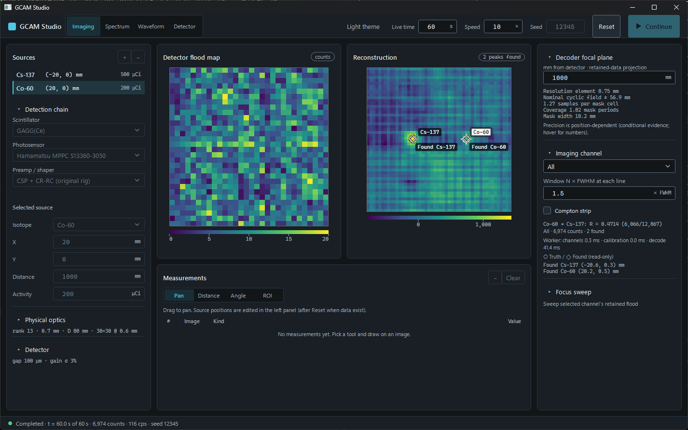

# Gcam — coded-aperture gamma camera simulator

[](https://github.com/Jwlee-IL/G-CAM-Simulator/actions/workflows/ci.yml)


A Monte Carlo re-creation, in C# / .NET 9, of a **coded-aperture gamma camera** I worked on in industry
(2017–2024): a gamma source shines through a **tungsten MURA mask**, the mask's shadow lands on a
**12×12 scintillator array**, and decoding that shadow tells you where the source is. The hardware
version found its sources by physically moving an isotope around the lab; here every geometry, decoder and
detector choice can be swept in software — and the signal chain goes down to **SystemVerilog checked
bit-for-bit against the C# model**.


<sub>Localization error over a grid of source positions (black = found within 3 mm), both decoders searching the
same ±18 mm grid — wider than one 19.7 mm mask period. Classical cyclic decoding assumes the shadow repeats, so a
source can land on any period replica (errors ≈ 19 mm, even inside the fully-coded field, cyan box) and sources
outside it ghost to the opposite side; finite-mask (non-cyclic) decoding breaks that ambiguity: 360/625 positions
vs 172/625. Hand-held head: rank-7 MURA, 16×16 × 1 mm pixels, mask–detector 55 mm, source plane 100 mm from the mask.
Plot: <code>samples/plot_sweep.py</code>.</sub>

### 한국어 요약
산업 현장에서 개발에 참여했던 부호화 구경(coded-aperture) 감마 카메라를 소프트웨어로 다시 만든 개인
프로젝트입니다. 광자 수송 몬테카를로 → 텅스텐 MURA 마스크 → 12×12 섬광체 → 복원(상호상관·MLEM)까지 전
과정을 구현했고, 신호 처리 회로는 SystemVerilog로 작성해 C# 모델과 **비트 단위로 같은지** cocotb로 검증합니다.
뷰어(GCAM Studio)는 계층 경계를 컴파일러가 강제하는 MVVM 구조입니다. 자세한 물리 해설은
[`docs/PAPER.ko.md`](docs/PAPER.ko.md).

## What is a gamma camera? (for non-specialists)

Radioactive material gives off **gamma rays** — light far too energetic for eyes or ordinary cameras. A gamma camera
shows *where* they come from, overlaid on a normal photo, so a radiation-safety worker can see a hidden or lost source
from a distance instead of walking around with a counter. (In hospitals the same name means a scanner that images a
tracer inside a patient; this project is the portable, find-the-source kind.)

Gamma rays pass through lenses, so they cannot be focused. Instruments use one of two tricks:

- **Coded aperture** — a thick tungsten plate with a pattern of holes sits in front of the detector. Each source casts
  the pattern's shadow, shifted by its direction; decoding the shadow gives the direction. Simple and sharp, best at
  low-to-medium energies, but it sees only what is in front of it.
- **Compton imaging** — a gamma ray scatters once in the detector and is absorbed again; the two positions and energies
  put the source on a cone. Many cones overlap at the source. It sees in all directions and works best at higher
  energies, but needs a detector that knows where inside it each interaction happened.

| Instrument (maker) | How it images | Detector | Notes |
|---|---|---|---|
| **iPIX** (Mirion) | coded aperture (tungsten mask) | 1 mm CdTe pixel detector on a Timepix chip | hand-held, about 2.5 kg |
| **Polaris-H** (H3D) | Compton imaging, all directions | 3-D position-sensitive CdZnTe crystal | about 4 kg, better than 1.1 % energy resolution at 662 keV |
| **GeGI** (PHDS) | both: coded aperture at low energy, Compton above ~250 keV | high-purity germanium (cooled) | finest energy resolution, so isotopes are told apart best |

**This project** is the coded-aperture kind, like iPIX, but with a **scintillator** (GAGG crystals read by light
sensors) instead of a semiconductor — cheaper and easier to make thick enough to stop high-energy gamma rays,
at the cost of energy resolution. Sources:
[iPIX](https://www.mirion.com/products/technologies/health-physics-radiation-safety-instruments/portable-radiation-measurement/gamma-imaging-systems/ipix-ultra-portable-gamma-ray-imaging-system),
[Polaris-H](https://www.sciencedirect.com/science/article/abs/pii/S0168900215000121),
[GeGI (OSTI)](https://www.osti.gov/servlets/purl/1764575).

### 감마 카메라란? (일반인용)
방사성 물질은 눈이나 일반 카메라로는 볼 수 없는 강한 빛, **감마선**을 냅니다. 감마 카메라는 그 감마선이 *어디서*
오는지를 일반 사진 위에 겹쳐 보여 줍니다. 계측기를 들고 돌아다니지 않아도 멀리서 숨겨지거나 잃어버린 선원을 찾을 수
있습니다(병원의 '감마 카메라'는 몸속 추적자를 찍는 장비로, 이 프로젝트와는 다른 종류입니다).
감마선은 렌즈로 모을 수 없어서 두 가지 방법을 씁니다. **부호화 구경**은 구멍 무늬가 뚫린 텅스텐 판의 그림자가
선원 방향에 따라 밀리는 것을 풀어 방향을 찾고(정면만 보지만 단순하고 선명함), **컴프턴 영상**은 검출기 안에서 한 번
산란되고 다시 흡수된 위치·에너지로 선원이 놓인 원뿔을 그려 여러 원뿔이 겹치는 곳을 찾습니다(전 방향, 높은 에너지에
유리). 대표 제품은 **iPIX**(Mirion, 부호화 구경), **Polaris-H**(H3D, 컴프턴), **GeGI**(PHDS, 두 방식 모두·게르마늄)
입니다. 이 프로젝트는 iPIX와 같은 부호화 구경 방식이되, 반도체 대신 **섬광체**(GAGG)를 써서 더 싸고 고에너지 감마선을 막을 만큼 두껍게 만들기 쉬운 대신
에너지 분해능을 양보한 구성입니다.

## What it demonstrates

| | |
|---|---|
| **Physics engine** | Photon transport with directional biasing (unbiased vs. 4π, ~100× fewer photons), Klein–Nishina Compton in the crystal, tabulated tungsten / scintillator cross sections, cross-correlation and **MLEM** decoders. One JSON config describes a scenario; ~40 CLI studies sweep it. |
| **Tests that check physics, not snapshots** | 300+ .NET tests. Each transport stage is held to a closed form — biased-source weight = the detector's solid angle, crystal stopping 1 − exp(−μt/cosθ), mask transmission = open fraction + tungsten leak, Compton energy conservation, decoder peak on an analytic shadow — with k·σ tolerances that follow the sample size; study-level tests assert physics (MLEM is non-negative and out-resolves cross-correlation, ghosts appear outside the fully-coded field) rather than pinning output numbers. A mutation check (Poisson off-by-one, half-pixel flood origin, slant path ignored) fails each one. |
| **Hardware path** | CR-RC⁴ / trapezoidal shapers and a baseline restorer in SystemVerilog. The RTL (cocotb + Icarus) and the native C# `Waveform` model (xUnit golden values) are each held **bit-exact** to one shared fixed-point reference (Q12 CR-RC state in Studio; legacy F=0 goldens retained), both in CI. Pipelining raised Fmax from 59 to 119 MHz (ECP5, nextpnr timing). |
| **Viewer** | GCAM Studio: live list-mode acquisition (Start / Stop / Continue / Reset over live time, with physical inputs locked until Reset); Imaging, Spectrum, Waveform and Detector workspaces — every count is one independent Compton-transported event, so in-crystal scatter mispositioning is part of the image. WPF + CommunityToolkit.Mvvm, split into `Studio.Core` (no WPF) → `Studio.Services` (only layer touching the engine) → `Studio` (views), so the boundaries are compiler-enforced; ViewModel tests plus a UI-automation harness with independent oracles. |
| **Self-correction on record** | When the crystal model moved to physical cross sections, earlier multi-isotope results got weaker; they were re-run and revised in place ([theme 52](docs/AGENTS.Findings.md#52-crystal-attenuation-from-tabulated-cross-sections--crystalmaterial-2026-10-01)), not left standing. |

## Headline results

| Result | Condition |
|---|---|
| Non-cyclic decoding roughly **doubles the correctly localized area** (360 vs 172 of 625 positions within 3 mm) | hand-held head, ±18 mm search grid, figure above (282 vs 148 on the 12×12 lab rig) |
| **MLEM separates two sources 2 mm apart** (≈1.1° seen from the mask); cross-correlation still merges them at 3 mm | ideal, high-count (800 k photons), source plane 100 mm from the mask |
| The real instrument's long-standing problem — **Co-60 downscatter counted as Cs-137** — is reproduced; per-pixel spectral stripping removes it from the 662 keV window, while spatial separation alone holds only up to Co:Cs ≈ 2:1 | GAGG crystal, physical cross sections |
| C# ↔ RTL **bit-exact** on all three shaper paths; pipelined shaper **59 → 119 MHz** | cocotb + Icarus; ECP5 nextpnr as the Fmax proxy |

The evidence behind these numbers — conditions, limits, reproduce command and, where one exists, the test that pins
it: [`docs/VV.Gcam.Evidence.md`](docs/VV.Gcam.Evidence.md) (EV-01, EV-11, EV-15, EV-17).
The full working log of all 54 study themes: [`docs/AGENTS.Findings.md`](docs/AGENTS.Findings.md).

GCAM Studio desktop — Imaging workspace, Cs-137 500 µCi + Co-60 200 µCi, dark theme:



## A 10-minute tour for reviewers

1. [`src/Gcam.Decoding/MlemDecoder.cs`](src/Gcam.Decoding/MlemDecoder.cs) — the MLEM update, with its approximations stated up front.
2. [`tests/Gcam.Tests/MlemTests.cs`](tests/Gcam.Tests/MlemTests.cs) and [`PipelineTests.cs`](tests/Gcam.Tests/PipelineTests.cs) — what "testing physics" looks like (e.g. `Biasing_IsUnbiasedVersus4Pi`).
3. [`src/Gcam.Masks/MuraGenerator.cs`](src/Gcam.Masks/MuraGenerator.cs) — MURA construction from quadratic residues.
4. [`rtl/crrc_shaper.sv`](rtl/crrc_shaper.sv) + [`rtl/test_crrc.py`](rtl/test_crrc.py) — gateware and the cocotb bench that holds it to the shared fixed-point reference (F=0 legacy / F=12 fractional state).
5. [`src/Gcam.Studio.Core/ViewModels/MainViewModel.cs`](src/Gcam.Studio.Core/ViewModels/MainViewModel.cs) and [`docs/DESIGN.Architecture.md`](docs/DESIGN.Architecture.md) — the viewer's layering.
6. [`docs/VV.Gcam.Overview.md`](docs/VV.Gcam.Overview.md) — the requirement set below, on one page.

## Design documents (V&V)

If the simulated camera were made into a hand-held product, what would it have to do — and how much can the simulator
already show? The `VV.*` documents answer that the way a regulated product's requirement set does (structured after
IEC 62304, no compliance claimed), and they are self-contained:

| Document | What it holds |
|---|---|
| [Overview](docs/VV.Gcam.Overview.md) | the whole set on one page — **start here** |
| [URS](docs/VV.Gcam.URS.md) | 19 user needs, use conditions from standards, real industrial reference sources, benchmark imagers |
| [PRS](docs/VV.Gcam.PRS.md) | 51 product requirements, each with its evidence and grade (simulated / analytical / standard / open), traced to the needs; Korean law |
| [Evidence](docs/VV.Gcam.Evidence.md) | 33 simulation and design-model results behind those numbers, each with the command that reproduces it and, where one exists, the test that pins it |
| [Limitations](docs/VV.Gcam.Limitations.md) | 9 things the concept cannot do, every fix and its cost |
| [Decisions](docs/VV.Gcam.Decisions.md) | 38 decisions with the author's reasons, and what is still open |
| [Studio SRS](docs/VV.Studio.SRS.md) · [SDS](docs/VV.Studio.SDS.md) · [V&V](docs/VV.Studio.md) | the engineering viewer as a software item: requirements, design record, test traceability, UI-automation validation |

## Build & run

```bash
dotnet build Gcam.sln -c Release
dotnet test  Gcam.sln -c Release          # engine + Studio regressions; desktop/render/evidence opt-ins skipped by default

# Long numerical evidence only (PowerShell: $env:GCAM_EVIDENCE_TESTS = '1'):
GCAM_EVIDENCE_TESTS=1 dotnet test tests/Gcam.Studio.Services.Tests -c Release --filter Category=Evidence --logger 'console;verbosity=detailed'

# single scenario -> flood map + reconstruction + source estimate (ASCII)
dotnet run --project src/Gcam.Cli -c Release -- samples/scenario.json

# list the study sub-commands (sweep, mlem, compton, depth, thermal, pileup, ...)
dotnet run --project src/Gcam.Cli -c Release -- help

# MVVM viewer (Windows)
dotnet run --project src/Gcam.Studio -c Release

# RTL: Icarus Verilog + cocotb 2.x
python rtl/run_cocotb.py
```

## Limitations

- **Not validated against measured data.** Correctness rests on physics invariants, tabulated cross sections
  (NIST / xraylib) and independent cross-review — not on a comparison with the real camera's recordings.
- The default geometry is small and near-field (12×12 × 1 mm pixels, source plane 100 mm from the mask);
  millimetre figures above are for that geometry.
- Many realism effects (thermal drift, pile-up, fabrication tolerance, …) turned out **small for this
  camera**, and are reported that way.

## How it was built

Built with AI coding agents (Claude Code, Codex) as development tools; what to build, the physics decisions
and the verification are mine, and every commit carries the agent's co-author line. Codex and an adversarial
reviewer agent cross-check the important claims — several fixes in the history came from those reviews.

## Where things live

| Path | What |
|---|---|
| `src/` | Core domain, masks, detector / Compton transport, decoders, simulation studies, CLI (`Gcam.Cli`, one class per study group under `Commands/`), GCAM Studio (`Gcam.Studio*`); `Gcam.Wpf` is the legacy viewer retained until TODO-12; Studio is the current viewer |
| `tests/` | xUnit — engine physics and closed-form invariants (shared rigs and k·σ assertions in `Gcam.Tests/Harness`), Studio ViewModels, the service layer against the real engine, UI-automation oracles and opt-in desktop scenarios |
| `rtl/` | SystemVerilog front-end, Icarus + cocotb benches ([`rtl/README.md`](rtl/README.md)) |
| `samples/` | Scenario JSON plus the result CSVs / figures each finding cites |
| `docs/` | V&V documents (above), viewer design notes (`DESIGN.*`), Korean physics write-up (`PAPER.ko.md`), and the working notes for contributors and AI agents (`AGENTS.*`) |
| [`AGENTS.md`](AGENTS.md) | Architecture, pipeline, coordinate frame, full command reference (also the entry point for AI agents) |

## License

Proprietary — **All Rights Reserved**. This repository is published for personal reference only; no
permission is granted to use, copy, modify, or distribute it. See [`LICENSE`](LICENSE).
