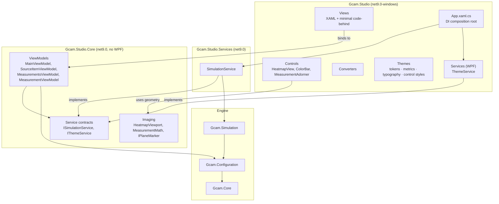
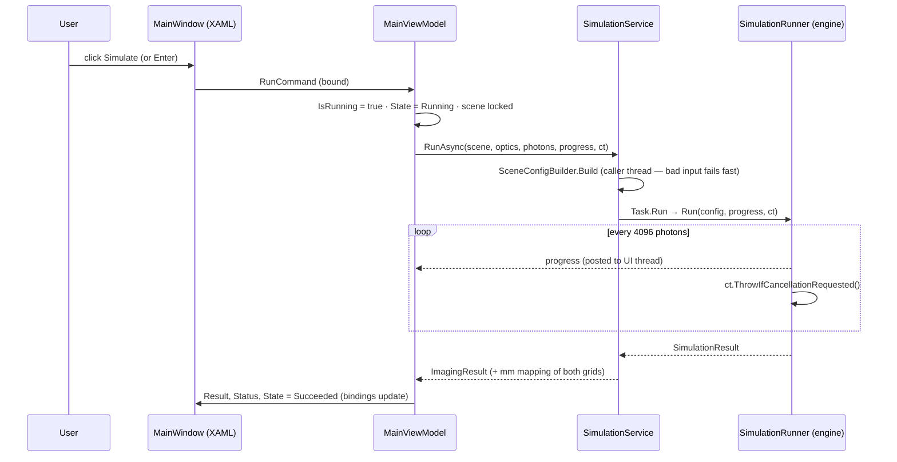

# DESIGN.Architecture — GCAM Studio layers, dependencies and run flow

Scope: the three Studio projects and their tests. The simulation engine's own architecture is in
[AGENTS.md](../AGENTS.md#solution-layout).

## Goals

1. **Boundaries enforced by the compiler, not by discipline.** A ViewModel must not be able to touch a WPF
   type; a view must not be able to call the simulation engine directly.
2. **Everything that has logic is testable without a UI stack.** ViewModels and view geometry (zoom, pan,
   coordinate mapping) live in plain `net9.0` and are unit-tested.
3. **The UI never blocks.** The Monte Carlo runs off the UI thread with progress and cancellation.

## Layers



| Project | Target | Contains | May reference | Must not contain |
|---|---|---|---|---|
| `Gcam.Studio.Core` | net9.0 | ViewModels, models (`ImagingResult`, `RunState`, `MeasurementDraft`), service contracts, UI-free view geometry and measurement maths (`HeatmapViewport`, `MeasurementMath`) | `Gcam.Core`, `Gcam.Configuration`, CommunityToolkit.Mvvm | any `System.Windows.*` type (it would not compile), I/O, the simulation engine |
| `Gcam.Studio.Services` | net9.0 | implementations of contracts that need the engine or the outside world (`SimulationService`) | `Gcam.Studio.Core`, `Gcam.Simulation` | UI types, ViewModel logic |
| `Gcam.Studio` | net9.0-windows | XAML views, custom controls, converters, theme dictionaries, WPF-bound services (`ThemeService`), the DI root | `Gcam.Studio.Core`, `Gcam.Studio.Services` | business rules, direct engine calls |
| `tests/Gcam.Studio.Tests` | net9.0 | ViewModel and geometry tests with fakes | `Gcam.Studio.Core` only | WPF |
| `tests/Gcam.Studio.Services.Tests` | net9.0 | `SimulationService` against the real engine | `Gcam.Studio.Services` (and through it the engine) | WPF |

Why the split matters in practice: `Gcam.Studio.Core` targets plain `net9.0`, so `using System.Windows.Media;`
in a ViewModel is a build error, and the ViewModel tests run on any machine without a UI stack.

### Where does new code go?

| You are writing… | Put it in | Example |
|---|---|---|
| State and commands a screen binds to | `Core/ViewModels` | `MainViewModel.RunCommand` |
| A data shape returned by a service | `Core/Services` (next to the contract) | `ImagingResult` |
| Maths a control needs but that has no UI types | `Core/Imaging` (or a new `Core/<Area>`) | `HeatmapViewport` (fit, zoom about a point, screen ↔ mm), `MeasurementMath` (distance, angle, ROI stats) |
| A contract a control needs from a ViewModel without knowing its type | `Core/Imaging` interface | `IPlaneMarker` — the overlay drags anything with `X`, `Y`, `MarkerLabel`; `SourceItemViewModel` implements it |
| Something that talks to the engine, files, network | a contract in `Core/Services` + implementation in `Gcam.Studio.Services` | `ISimulationService` / `SimulationService` |
| Something that needs WPF to do its job | a contract in `Core/Services` + implementation in `Gcam.Studio/Services` | `IThemeService` / `ThemeService` |
| A reusable visual element with its own rendering or input | `Gcam.Studio/Controls` | `HeatmapView`, `ColorBar` |
| A value → presentation mapping | `Gcam.Studio/Converters` | `NullToCollapsedConverter` |
| Layout of a screen | `Gcam.Studio/Views/*.xaml` | `MainWindow.xaml` |
| A colour, size, text role or shared style | `Gcam.Studio/Themes` — see [DESIGN.Color](DESIGN.Color.md), [DESIGN.Layout](DESIGN.Layout.md), [DESIGN.Typography](DESIGN.Typography.md), [DESIGN.Controls](DESIGN.Controls.md) | `Brush.Accent`, `Gap.Field`, `Text.Label` |

## Dependency injection

`App.xaml.cs` is the only place that knows concrete types:

```csharp
.AddSingleton<ISimulationService, SimulationService>()
.AddSingleton<ThemeService>()
.AddSingleton<IThemeService>(sp => sp.GetRequiredService<ThemeService>())
.AddSingleton<MainViewModel>()
.AddSingleton<MainWindow>()
```

ViewModels receive contracts through their constructor, which is what lets the tests pass fakes
(`FakeSimulation`, `FakeTheme` in `MainViewModelTests`).

## A simulation run, end to end



- **Cancellation**: `RunCancelCommand` (generated by `[RelayCommand(IncludeCancelCommand = true)]`) cancels the
  token; the engine throws `OperationCanceledException`, the ViewModel keeps the previous result and sets
  `State = Cancelled`.
- **Failure**: any other exception becomes `State = Failed` and a status line, never an unhandled crash.
- **Progress race**: `Progress<T>` posts reports asynchronously, so a late report can arrive after completion.
  The ViewModel accepts reports only while running and never lets the bar move backwards (a test pins this).

## Testing strategy

| What | Where | How |
|---|---|---|
| ViewModel behaviour (commands, can-execute, state, cancel, failure, theme toggle) | `tests/Gcam.Studio.Tests/MainViewModelTests.cs` | fakes for the service contracts |
| View geometry (fit, snapping, zoom anchor, pan limits, screen ↔ image ↔ mm) | `tests/Gcam.Studio.Tests/HeatmapViewportTests.cs` | pure maths, no UI |
| Measurement maths (distance, angle, ROI by pixel centre, clipping) | `tests/Gcam.Studio.Tests/MeasurementMathTests.cs` | pure maths, no UI |
| Measurement session (numbering, selection, delete / clear, ROI refresh on a new result), stale-result flag | `MeasurementsViewModelTests.cs`, `MainViewModelTests.cs` | ViewModels with fakes |
| Scene → config, runner progress / cancellation | `tests/Gcam.Tests/SceneConfigBuilderTests.cs` | engine-level |
| The service layer (same run as the engine, flood axis on the decoder's pixel centres, argument errors before scheduling, progress, cancellation) | `tests/Gcam.Studio.Services.Tests/SimulationServiceTests.cs` | the real engine, no fakes |
| Oracles of the UI tests (where the image sits on screen, mm per pixel, row parsing) | `tests/Gcam.Studio.UiTests/FloodOracleTests.cs` | pure maths, runs everywhere |
| The running app | `tests/Gcam.Studio.UiTests/PilotTests.cs`, `ScenarioTests.cs` — opt-in (`GCAM_UI_TESTS=1`), real window, real pointer, a fresh app per scenario | AutomationIds, run state in `ItemStatus`; sandboxed and owned process ([AGENTS.UiAutomation](AGENTS.UiAutomation.md)) |
