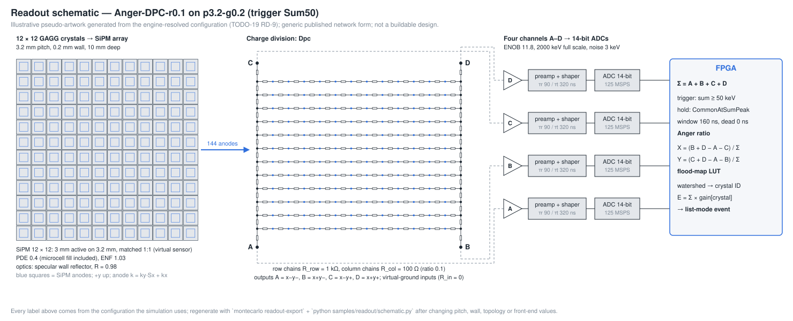
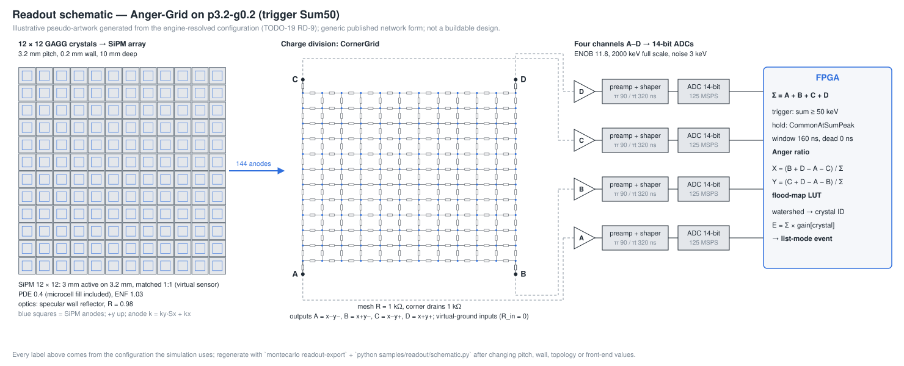

# HW.Readout — the simulated four-output readout, drawn from its own configuration

Scope: the schematic ("pseudo-artwork") and the charge-division netlist of the physical readout the engine simulates for
TODO-19 ([PLAN.Physics.RigReadout](archive/PLAN.Physics.RigReadout.md), RD-9 / RD-10). Both are generated from the configuration
the readout study runs, so they change when pitch, wall, sensor grid, network topology or front-end values change.
**Illustrative only:** the network is the generic published form of its topology; nothing here is a buildable board
design or the layout of any particular instrument.

## How they are made

`montecarlo readout-export <scenario> <request> <geometry> <readout> <trigger> <prefix>` resolves one geometry × readout ×
trigger of a study request exactly as `ReadoutStudy` does and writes `<prefix>.config.json` (every drawn value after the
engine's defaults, plus the engine's DC charge fractions per SiPM) and, for a solved circuit, `<prefix>.cir` (SPICE).
`samples/readout/schematic.py` draws `<prefix>.svg` from the config; `samples/readout/netlist_check.py` solves the netlist
with its own standard-library nodal analysis (Gaussian elimination with partial pivoting — not the engine's Cholesky
solve, and without calling the engine) and compares. `python samples/readout/regenerate.py` rebuilds everything in
`docs/assets/readout/` byte-identically; `samples/evidence/tests/test_readout_netlist.py` re-checks it in CI.

## Discretised positioning circuit (3.2 mm pitch, column / row resistance 0.1)

12 × 12 GAGG crystals, 1:1 SiPMs (a virtual sensor of the crystal's active width), row resistor chains feeding two column
chains whose ends are the outputs A–D, one preamp / shaper and 14-bit ADC per output, and in the FPGA the sum trigger, the
common hold at the sum peak, the four-corner Anger ratio and the flood-map look-up table.

## Corner-drained resistor grid (the same geometry)

## Netlist vs engine (RD-10)

Each SiPM node is driven with 1 A in turn; the four output currents are its charge fractions. The two solvers must agree
within the normwise forward-error bound of a backward-stable solve (Higham, *Accuracy and Stability of Numerical
Algorithms*, Thm 7.2; growth factor ≤ 2 for a diagonally dominant matrix): per solver
‖g_out‖₁ · ‖v‖∞ · (k/(1 − k) + γ_d), k = 2·γ_{3n}·κ∞(G), γ_m = m·u/(1 − m·u), u = 2⁻⁵³, doubled for two solvers.

| Netlist | Unknowns | κ∞(G) | Bound | Max deviation | Max charge imbalance |
|---|---:|---:|---:|---:|---:|
| `readout-p3.2-g0.2-dpc-r0.1.cir` | 168 | 1.50e3 | 1.14e-8 | 2.4e-15 | 6.9e-15 |
| `readout-p3.2-g0.2-dpc-r1.0.cir` (equal resistors) | 168 | 1.01e3 | 1.09e-9 | 6.7e-15 | 7.1e-15 |
| `readout-p3.2-g0.2-grid.cir` | 144 | 6.29e2 | 1.59e-10 | 1.0e-15 | 4.0e-15 |

The exact values are in the `*.comparison.json` files beside each netlist.

## Why the DPC resistance ratio is swept (RD-12)

From the engine-exported charge fractions of a 12 × 12 DPC (noiseless, sensor-level Anger X), the spacing of neighbouring
spots in the middle rows, relative to the ideal 2/S, shrinks as the column chains become comparable to the row chains —
the hour-glass flood:

| Column / row ratio | 1.0 | 0.7 | 0.5 | 0.3 | 0.2 | 0.15 | 0.1 | 0.05 | 0.03 | 0.01 | 0.001 |
|---|---|---|---|---|---|---|---|---|---|---|---|
| middle-row span / edge-row span | 0.24 | 0.33 | 0.42 | 0.57 | 0.67 | 0.73 | 0.81 | 0.90 | 0.94 | 0.98 | 1.00 |
| min. middle-row spot spacing / (2/S) | 0.15 | 0.22 | 0.30 | 0.43 | 0.54 | 0.61 | 0.69 | 0.79 | 0.84 | 0.89 | 0.92 |

The look-up table's marker search suppresses peaks closer than 0.5 of the nominal spacing, so blind calibration is
predicted to fail between ratio 0.3 and 0.2; the separable limit is S/(S + 1) = 0.923 (the chain ends). The study sweeps
1.0 (equal resistors, the known failure), 0.3 and 0.2 (either side of the predicted boundary), 0.1, 0.03 and 0.01
(within 4 % of the limit).

## Limits of the drawing

The engine's network is DC (charge fractions); no RC response, skew or amplifier model is drawn or simulated (RD-5).
Values on the drawing are the simulation's inputs, not component recommendations. The SiPM size of a matched sensor is
virtual; the optics (specular 0.98 wall, RD-11) are assumptions.

## Selected preset (TODO-19 stage 1, EV-36)

The readout study selected and confirmed four outputs through a DPC with column / row resistance ratio 0.01
(R_col = 10 Ω against R_row = 1 kΩ), a sum trigger at 50 keV, a specular 0.98 reflector and 1 mm pitch (pitch settled
on fresh seeds). The drawings above show other configurations of the same study (3.2 mm pitch; ratio 0.1, now marginal,
and the equal-resistor case that cannot be calibrated). The 1 mm result assumes unlimited SiPM microcells (LIM-11).
