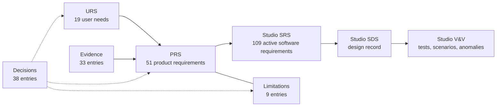

# VV.Gcam.Overview — the Gcam locator concept on one page

Scope: a summary of the verification & validation set for the hand-held gamma-source locator that Gcam's simulations
were used to design — what it is for, what it must do, what the evidence shows, what it cannot do yet, and where to
read further. Every statement here is backed by a row in one of the documents listed at the end.

## What this is

Gcam is a Monte Carlo simulator of a scintillator coded-aperture gamma camera — a clean-room personal
reimplementation that contains no former-employer source code, measurement data, proprietary schematics or
confidential materials. The V&V set asks *if this camera were made into a hand-held product, what would it have to
do, and how much of that can the simulator already show?* It is organised the way a regulated product's
requirement set is — user needs, product requirements, evidence, limitations and decisions, each traceable to the
next — but it is a **design study**: nothing is being built, nothing is measured on hardware, and no regulatory claim
is made. It is a personal design exercise by the author, not any company's product plan or roadmap; the needs and
use conditions come from published standards, published data of same-class products and this simulator's results.

**Ideal conditions.** Unless an evidence entry says otherwise, its numbers come from an **ideal environment**: only
the simulated source(s), **no ambient (natural) background radiation**, an ideal detector response and known geometry.
They are best-case bounds. A real field adds a source-independent Poisson background. Measured with an absolute terrestrial
ambient field (0.05–0.20 µSv/h, bare-crystal and front-only bounds), it raises the counts a trusted location needs
when every deposit is used and the crystal is exposed, while the 662 keV window or a well-shielded head leaves most
results at their ideal values; which results change, and how, is listed in
[Evidence §1](VV.Gcam.Evidence.md#ideal-conditions-and-background) (EV-34).

**In numbers:** 19 user needs (18 active) → 51 product requirements (48 active) → 33 evidence entries; 9 known limitations;
57 decisions with the author's reasons. The engineering viewer has 109 active software requirement IDs (nine withdrawn), four workspaces, and current unit/integration
test totals in [VV.Studio](VV.Studio.md#current-test-inventory), plus 12 opt-in desktop regression scenarios, a plot gate and a survey.

## The problems it starts from

| Known problem of the camera class | What the concept does about it |
|---|---|
| Characterising a camera means moving the radioactive source by hand | the simulator sweeps geometry, decoder, crystal and electronics in software (UN-08) |
| Co-60 downscatter lands in the Cs-137 energy window and reads as Cs-137 | per-pixel Compton stripping recovers the Cs-137 count, at a cost: at 10 µSv/h of Co-60 the smallest detectable Cs-137 source at 1 m is 1.6 MBq in 60 s; spatial separation alone holds only to Co : Cs ≈ 2 : 1 (EV-15, LIM-08) |
| SiPM gain drifts with temperature, so the energy window walks | temperature-compensated SiPM bias, peak tracking and window widening — no built-in source (EV-28, D-18, D-20) |
| Cyclic decoding shows sources outside the field as ghosts on the opposite side | finite-mask (non-cyclic) decoding plus a flood-centroid "outside the field" cue (EV-01, EV-02) |

## The concept

| | |
|---|---|
| Imaging | rank-7 tungsten MURA mask (1 mm cells, 10 mm thick) 55 mm in front of a 16 × 16 array of 1 mm GAGG:Ce,Mg crystals read by SiPMs |
| Reconstruction | non-cyclic cross-correlation (MLEM with a pixel-area forward model optional: two sources resolved 1.30° apart at 1 m); energy windows with Compton stripping |
| Electronics | 14-bit / 125 MSPS ADC, FPGA pulse shaping (the shapers exist in SystemVerilog) |
| Form | pistol grip under the centre of mass; ~8 mm tungsten shield, which is most of the mass; Windows tablet that docks on the instrument and undocks for remote use |
| Dose rate | a separate small counter outside the shield, read over a data I/O link (D-37) |
| Targets | ≤ 2.5 kg, −10 … +45 °C, IP65, 60 cm drop — the level of the same-class commercial imager, Mirion iPIX |

## What it must do, and what the evidence shows

| Requirement | Target | Evidence | Grade |
|---|---|---|---|
| Locate a source (PR-IMG-02) | precise to a fraction of the resolution element at 1 m | 0.38° RMS at 250 counts, 0.21° at 1000, averaged over position (EV-09) | MC |
| Usable field of view (PR-IMG-10) | wider than the ±3.6° fully coded field | **±6–7.5°** along the axes at 1 m and 5 m without background (±7–7.5° at high counts); ±5–6.5° with background equal to the signal (EV-02) | MC → DEC |
| Say which way to turn (PR-IMG-08) | side of a source outside the field | correct side from ~1° to ~14.5°; needs a background estimate (EV-02) | MC |
| Separate Co-60 from Cs-137 (PR-NRG-04) | weaker Cs-137 count and position | co-located count recovered within 0–1 % (oracle ratio); position only to Co : Cs ≈ 2 : 1, held in 126 / 128 seeds; with stripping, at Co-60 10 µSv/h, 1 m: detection limit 75.5 / 181 / 402 counts and location from 500 / 1000 / 2000 counts at 10 / 60 / 300 s (EV-15) | MC |
| Sensitivity (PR-SENS-01, -07) | iPIX parity: 2 µSv/h Cs-137 located in < 30 s | 2.48× the GAGG reference lab geometry (EV-09); ~2 s estimated ([URS §5](VV.Gcam.URS.md#reference-measurement-conditions-adopted)) | MC, AN |
| Dose rate (PR-SAFE-01, -02) | ±50 % to 10 mSv/h, 60 keV – 1.33 MeV | the imaging head reads ±13 % frontally but only 0.11–0.66 of the dose 10° off axis (EV-23) — so a separate counter is the dose channel; its type test is the evidence | STD, DEC |
| No under-reading in high fields (PR-SENS-05) | over-range indication to 1 Sv/h | method shown on the imaging front end: live-time correction to ~150 mSv/h, then the live fraction signals over-range (EV-23); to be set for the counter | AN |
| Mass (PR-PHY-01) | ≤ 2.5 kg | ~1.5–2 kg with an 8 mm shield (EV-24, EV-25) | AN |
| Durability (PR-DUR-01 … 04) | iPIX level | cannot be shown by simulation — hardware type tests | STD |

Grades: **MC** Monte Carlo, **RTL** front-end model, **AN** analytical design model, **DEC** design decision,
**STD** target from a standard, **OPEN** no design yet, **LAW** legal obligation. Of the 48 active requirements, 16
rest on MC, 4 on RTL, 11 on AN; 5 are decisions, 7 hardware targets and 4 still open.

## What it cannot do yet

| Limitation | Status |
|---|---|
| **Narrow field of view** — fully coded ±3.6° against 41–49° for iPIX (LIM-01) | software path adopted: ±6–7.5° usable field, out-of-field cue, hand sweep; the sweep itself is not simulated |
| **Ghosts move, they don't vanish** — past ~7° the decoder answers with a wrong in-field spot (LIM-07) | the flood centroid flags those answers; weaker in strong background |
| **Spatial isotope separation is limited** (LIM-08) | stripping recovers the count, not the position |
| **The imaging head reads dose only frontally** — it is a collimator (LIM-09) | decided: a separate small counter over data I/O (D-37); the counter is not yet chosen or simulated |
| **The evidence has limits** (LIM-06) | precision and sensitivity at the lab distance; no side walls in the field studies; nothing measured on hardware; MC numbers are seed-ensemble spreads, conditional on fixed manufactured patterns where a study uses them |

## Decisions that shaped it

| Decision | Author's reason |
|---|---|
| Non-cyclic decoding; no mask-rotation hardware (D-17, D-19) | "마스크를 돌리는 하드웨어는 너무 비용이 커" — rotation hardware costs too much |
| No built-in radioactive source (D-18) | "내장은 안 돼. 비싸기도 하고 취급도 어려워" — expensive, hard to handle, and it would make the device a regulated radiation device |
| Dose rate from a separate small counter over data I/O (D-37) | "소형 계수기 같은 건 싸니까 이걸 데이터 I/O로 받는 게 더 싸고 직관적일 것 같아" |
| Dose rate required, at the IAEA NSS-1 range, with the calibration obligation (D-21) | "선량률 기능은 넣어야 하고 … 교정 의무는 추가"; "NSS 기준으로" |
| Compare only with the same class of imager (D-32) | "이건 섬광체 카메라야. 컴프톤 카메라와 기준을 동일시 할 수 없어" — a scintillator camera, not a Compton camera |
| The V&V set is self-contained (D-35) | otherwise "VV 문서 자체가 완결성이 떨어진다" — the documents would not be complete in themselves |

## The documents

| Read | For |
|---|---|
| this page | the whole picture in five minutes |
| [VV.Gcam.URS](VV.Gcam.URS.md) | who the users are, what they need, under which conditions, against which reference sources and benchmark imagers |
| [VV.Gcam.PRS](VV.Gcam.PRS.md) | every product requirement with its target, evidence and grade; traceability to needs; applicable Korean law |
| [VV.Gcam.Evidence](VV.Gcam.Evidence.md) | each simulation result: what it shows, conditions, limits, how to reproduce it, which test pins it |
| [VV.Gcam.Limitations](VV.Gcam.Limitations.md) | what the concept cannot do, every fix and what each fix costs |
| [VV.Gcam.Decisions](VV.Gcam.Decisions.md) | the author's decisions in the author's words, what was rejected, what is still open |
| [VV.Studio.SRS](VV.Studio.SRS.md), [VV.Studio.SDS](VV.Studio.SDS.md), [VV.Studio](VV.Studio.md) | the engineering viewer as an IEC 62304-style software item: requirements, design record, verification and validation |
