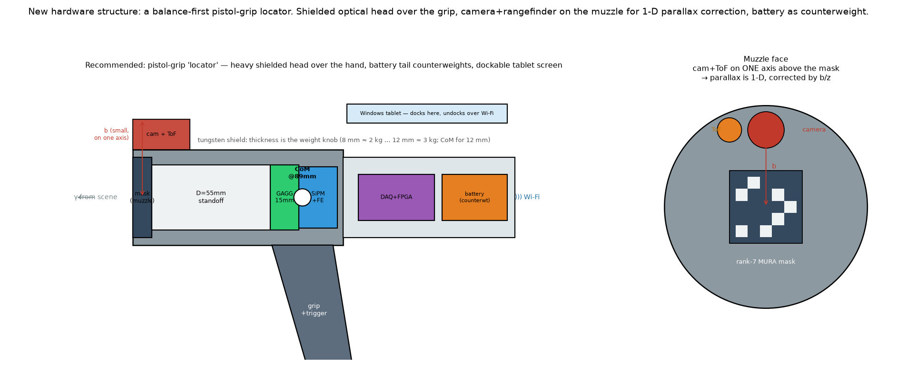

# VV.Gcam.PRS — product requirements for a Gcam gamma-source locator

Scope: product-level requirements for the **hand-held coded-aperture locator** that Gcam's simulations were used to
design, traced up to the [URS](VV.Gcam.URS.md) and down to subsystems. The viewer subsystem continues in
[VV.Studio.SRS](VV.Studio.SRS.md). Not covered: the simulator's own software requirements beyond the viewer.

**At a glance**
- **51 requirements** (48 active) in ten groups, plus 5 regulatory ones (§6). Each row names its evidence (`EV-xx`
  in [VV.Gcam.Evidence](VV.Gcam.Evidence.md)) and the grade of that evidence (§1): 16 simulated (MC), 4 front-end
  model (RTL), 11 analytical (AN), 5 design decisions, 7 hardware type-test targets (STD), 4 with no design yet.
- The concept (§2): rank-7 tungsten MURA mask, 16 × 16 GAGG:Ce,Mg at 1 mm, D = 55 mm, non-cyclic decoding, ~8 mm
  tungsten shield, a separate small dose counter, pistol grip and a docking Windows tablet; ≤ 2.5 kg.
- Strongest evidence: sub-mm localisation (0.25 mm floor), a usable field of ±6–7.5° at field distance, Compton
  stripping of Co-60 downscatter.
- Largest gaps (§4): narrow field of view, a dose counter chosen but not yet specified, no "no source" test,
  nothing measured on hardware.

> **Status: design-only.** The product is a concept, not being built. Decisions taken with the author, with their
> reasons, are in [VV.Gcam.Decisions](VV.Gcam.Decisions.md) (D-01 …). Every number here comes from the Gcam
> simulations or the analytical design models built on them, and each row says which. Nothing has been measured on
> hardware; the durability rows (STD) are targets from standards that no simulation can check. No regulatory claim
> is made.

## 1. Evidence grades

Every requirement carries the grade of the evidence behind its number, so a reader can see what is simulated and
what is reasoned:

| Grade | Meaning |
|---|---|
| **MC** | Gcam Monte Carlo (C#), reproducible by a CLI study and pinned by a test; the numbers are seed-ensemble values ([Evidence §1](VV.Gcam.Evidence.md#1-the-tools-behind-the-grades)) |
| **RTL** | front-end model: SystemVerilog + cocotb, or the Python front-end models in `rtl/` |
| **AN** | analytical design model (Python) built on MC-validated laws; first-order, not transport-grade |
| **DEC** | design decision derived from MC / RTL / AN results; nothing further to measure in simulation |
| **STD** | value taken from a published standard or the same-class benchmark (iPIX) ([URS §4](VV.Gcam.URS.md#4-use-conditions-from-standards)); Gcam cannot show it — it needs a hardware type test |
| **OPEN** | requirement set by a user need, but the concept has no design or evidence for it yet (§4) |
| **LAW** | obligation from a law or regulation (§6); shown by conformity assessment, not by simulation |

The evidence itself — result, conditions, limits, reproduce command, test — is in
[VV.Gcam.Evidence](VV.Gcam.Evidence.md); the **Basis** column below cites it by `EV-` ID.

**Geometry.** Unless a row says otherwise, MC localisation and sensitivity numbers are at the **lab distance** of the
reference lab geometry (source plane 100 mm from the mask). The field-of-view (EV-02) and dose (EV-23) studies run at 1 m
(and 5 m), where accuracy is quoted as an angle.

**Environment.** Unless a row says otherwise, the MC basis is an **ideal environment** — the simulated source(s)
only, no ambient (natural) background, an ideal detector response — so a quoted value is a best-case bound, not a
verified field performance. What changes under an absolute terrestrial ambient field — measured for localisation,
field of view, the trust gate, mask / antimask and isotope separation, expected for the rest — is listed in
[VV.Gcam.Evidence §1](VV.Gcam.Evidence.md#ideal-conditions-and-background).

## 2. Product concept

### Recommended configuration

| Part | Choice | Why |
|---|---|---|
| Mask | rank-7 MURA, 2 × 2 mosaic, 1 mm cell, 10 mm tungsten | field ÷ resolution = rank (EV-03); ~10 mm W balances leak against collimation (EV-04) |
| Detector | 16 × 16 pixels @ 1 mm, 15 mm thick GAGG:Ce,Mg, SiPM readout | ~2 pixels per mask-cell shadow (EV-06); dense, rugged, non-hygroscopic, low-voltage, low afterglow (EV-19, EV-21) |
| Geometry | mask–detector D = 55 mm | sensitivity against ghost margin (EV-01, EV-09) |
| Decode | non-cyclic (finite mask) | suppresses ghosts; the cyclic ghost margin at D = 55 mm is only 1.35 (EV-01) |
| Shield | 5-sided W, ~8 mm; front matched to the mask (10 mm) | sized to scattered background, not to Co-60 (EV-25) |
| Front end | 14-bit / 125 MSPS ADC (AD9648 preset), FPGA shaper | EV-17 |
| Form | pistol grip under the centre of mass, battery in a rear tail, camera + ToF at the muzzle, a Windows tablet that docks on the instrument (PR-PHY-04) | balance (EV-24) |

### Subsystems

| ID | Subsystem | Lower-level specification |
|---|---|---|
| SS-1 | Imaging head — mask, crystal array, shield | this PRS + the design models of EV-24 … EV-28 |
| SS-2 | Front-end electronics — SiPM bias, ADC, FPGA shaper / peak detection | this PRS + `rtl/` ([rtl/README](../rtl/README.md)) |
| SS-3 | Reconstruction — decoding, energy windowing, Compton stripping | this PRS + the engine and its tests |
| SS-4 | User interface — images, overlay, measurements; runs on a Windows tablet (PR-PHY-04) | **not specified as a product UI.** GCAM Studio ([VV.Studio.SRS](VV.Studio.SRS.md)) stays the simulator's engineering viewer and is **not** grown into the product UI (D-34); its SR-SEC-01 (no file I/O) therefore stands |
| SS-5 | Auxiliary sensors — scene camera, ToF / LiDAR, IMU | this PRS |
| SS-6 | Mechanics and power — housing, grip, battery, thermal path | this PRS |

**No separate RS.** The intermediate requirement layer between PRS and SRS is not written: for SS-4 the
[VV.Studio.SRS](VV.Studio.SRS.md) fills it; for the other subsystems the PRS rows below are the lowest-level
requirements, and a subsystem SRS is due only if that subsystem is ever built.

## 3. Product requirements

Columns: **Requirement** (with its target), **Basis** (evidence in [VV.Gcam.Evidence](VV.Gcam.Evidence.md), or the
source of a target), **Grade** (§1), **UN** (user need), **SS** (subsystem).

### Localisation and imaging (`PR-IMG`)

| ID | Requirement | Basis | Grade | UN | SS |
|---|---|---|---|---|---|
| PR-IMG-01 | Decoding is non-cyclic (finite-mask), so a source outside the fully-coded FOV does not appear as a ghost inside it. **Chosen ghost-suppression method (2026-10-01)**; mask rotation (mask / antimask hardware) rejected on cost. | EV-01: the hand-held head localises 361 / 625 grid positions non-cyclic against 174 / 625 cyclic (medians over 64 seeds); EV-02: the ghost boundary moves from 3.6° to ~7°, it does not vanish (LIM-07) | MC | UN-01, UN-11 | SS-3 |
| PR-IMG-02 | Localisation precision reaches a floor of **0.25 mm RMS on axis** (0.53 mm at the 8 mm edge), and is sub-mm with ≥ 250 detected counts on axis and ≥ 500 at the edge. | EV-09 (GAGG reference geometry 0.35 mm); EV-08 (sub-cell interpolation) | MC | UN-01, UN-07 | SS-1, SS-3 |
| PR-IMG-03 | Several sources of different isotopes in one field are each localised < 1 mm inside the FCFOV in a single acquisition (Cs-137 + Co-60 + Co-57: 0.55 / 0.27 / 0.93 mm; number of sources known). | EV-10 | MC | UN-01, UN-02 | SS-3 |
| PR-IMG-04 | An optional likelihood (MLEM) reconstruction resolves source pairs 2–3 mm apart that cross-correlation merges, with a non-negative image. **Performance-critical (D-41):** measured only in the lab near field (source 100 mm from the mask); the field-distance angular separation against the cell / D baseline is not yet measured, so this is not a field-performance figure. | EV-11 | MC | UN-01 | SS-3 |
| PR-IMG-05 | The source marker is registered to the scene-camera image to better than the gamma resolution (~1°) at all ranges, by reprojecting with the known camera baseline *b* and the measured range *z* (Δθ = arctan(b/z); uncorrected, b = 40 mm gives 7.6° at 0.3 m). | EV-26 | AN | UN-01, UN-05 | SS-3, SS-5 |
| PR-IMG-06 | The detector samples each mask-cell shadow with ≥ 1 pixel (Nyquist), ~2 nominal. | EV-06 (16 × 16 reduces the 12 × 12 error by about a third) | MC | UN-01 | SS-1 |
| PR-IMG-07 | The device reports "no source" when the energy histogram shows no photopeak above background **and** no reconstruction peak passes a significance test (ghost margin / peak-to-sidelobe). **No fixed false-positive-rate target** (author, 2026-10-01): it depends on the local background and would make the product needlessly strict; the evidence behind each verdict is shown instead. | author 2026-10-01 (energy histogram); ghost margin EV-01; peak-to-sidelobe EV-30; EV-02: past ~14° the decoder still reports an in-field spot in ~60 % of acquisitions, so the test is needed — threshold and rates not studied | OPEN | UN-11 | SS-3, SS-4 |
| PR-IMG-08 | **Depends on ghost suppression (PR-IMG-01) holding at field conditions.** The device detects when the dominant signal comes from outside the fully-coded field and tells the user which way to turn. The flood centroid gives the correct side from ~1° to ~14.5° off axis (≥ 95 %) and flags "outside" in ≥ 90 % of acquisitions at 4–12.5° (N0 5000) / 6–11.5° (N0 500); with background equal to the signal the flag rate peaks at ~70 %, so the cue needs a background estimate. Past ~14° no direction can be given. | EV-02 | MC | UN-12 | SS-3, SS-4 |
| PR-IMG-09 | Angular resolution ≈ 1° (one mask cell over D: 1 mm / 55 mm); iPIX, the closest coded-aperture comparator, specifies 2.5–6°. | URS §5 benchmark; geometry; EV-03 | AN | UN-01 | SS-1, SS-3 |
| PR-IMG-10 | **Adopted path (2026-10-01, D-16):** software only — the usable field of non-cyclic decoding, **±6–7.5° along the axes** without background (7.0° at 1 m and 7.5° at 5 m with 5000 on-axis counts; 6.0° / 7.0° with 500); ±5–6.5° with background equal to the signal; worse on the diagonal at low counts — instead of the ±3.6° fully-coded field; an out-of-field cue that tells the user which way to turn (PR-IMG-08); and a hand sweep stitched with IMU / VIO, ~10–14 pointings for a 45° × 45° view, no more than ~28° apart so the cue always has a source within ~14°. Rank-up + tapered channels (LIM-01 B + E) stay the hardware fallback if field trials show the search takes too long. | EV-02; LIM-01; EV-03, EV-05 | DEC | UN-01, UN-12 | SS-1, SS-3 |

### Energy and isotope separation (`PR-NRG`)

| ID | Requirement | Basis | Grade | UN | SS |
|---|---|---|---|---|---|
| PR-NRG-01 | One gain setting covers 122–1332 keV (gain set by the highest line, not the primary source), without degrading the 122 keV line. | EV-16 | RTL | UN-02 | SS-2 |
| PR-NRG-02 | Energy resolution ≈ 6–7 % FWHM at 662 keV with realistic noise (intrinsic ~6 % dominates; 6.2 % with the full noise chain). | EV-17 (GAGG photo-electron budget 5.7 %) | RTL, MC | UN-02 | SS-1, SS-2 |
| PR-NRG-03 | Events are positioned by total-energy window + largest-deposit pixel (Argmax), giving **~2× the counts** of per-pixel windowing (12 % vs 6 % of the ideal counts) and a lower RMS and failure rate (3.6 vs 5.5 mm, 18 % vs 40 % fails at a budget of 400 ideal effective counts — the comparison, not the absolute RMS, is the result). | EV-14 | MC | UN-07 | SS-3 |
| PR-NRG-04 | A higher-energy isotope's downscatter in a lower line's window is removed by **per-pixel Compton stripping**, which recovers a co-located Cs-137 count (0–1 % error, R = 0.469). **Spatial separation alone is limited:** in a 662 keV window with 1 mm GAGG pixels, Co-60 downscatter is ~55 % of the window (equal-photon-budget demonstration) and the Cs-137 peak is lost once Co-60 is ~4× stronger (holds at 2× in 126 / 128 seeds). Requires a calibrated downscatter / photopeak ratio — not blind separation. **Performance-critical (D-42):** the statistical cost of stripping (Cs-137 detection limit versus Co : Cs) is not yet quantified. | EV-15 | MC | UN-03 | SS-3 |
| PR-NRG-05 | Energy gain is calibrated per channel; position needs no per-pixel uniformity correction. | EV-18 (15 % gain σ smears 7.3 → 18.4 % FWHM; calibration restores it) | RTL, MC | UN-02 | SS-2, SS-3 |
| PR-NRG-06 | Each located source is labelled with its radionuclide from the declared set (Cs-137, Co-60, Ir-192; Co-57 for tests), and for U2 with the plain category **"industrial" (산업용)** — the only category used (2026-10-01). Identification against a full library over 30 keV – 3 MeV is **not** in the concept. | EV-16, EV-10 (known lines only); NSS-1 §6.4.1, §6.4.18 for the RID scope | OPEN | UN-02, UN-18 | SS-3, SS-4 |

### Sensitivity, rate and time to result (`PR-SENS`)

| ID | Requirement | Basis | Grade | UN | SS |
|---|---|---|---|---|---|
| PR-SENS-01 | Geometric efficiency **2.48 × 10⁻⁴** for Cs-137 in the hand-held head — **2.48×** the GAGG reference lab geometry (1.00 × 10⁻⁴) — giving a sub-mm location in ~1 s from a 1 MBq Cs-137 source on axis at the lab distance. | EV-09 | MC | UN-07 | SS-1 |
| PR-SENS-02 | A result whose evidence is too weak is flagged as unreliable; the time still needed may be shown as an **estimate**, labelled as such — never as a definite verdict. A location is trusted only when a **calibrated search significance** (the decoded image studentised against the instrument's background-shape model) reaches a threshold set **per configuration** (head, distance, exposure, ambient level, energy window) so that background-only acquisitions give **≤ 1 % false-trusted locations per acquisition** (one-sided 95 % upper limit), and the source strength needed is the smallest net count at which **≥ 95 %** of acquisitions are trusted and **within one angular resolution element**. Simulated: 96 / 96 configurations meet the 1 % limit on seeds not used to set the thresholds (pooled 0.308 %); the net counts needed grow with the background (lab centre, 60 s, bare-crystal bound, all deposits: 500 / 500 / 1000 at 0.05 / 0.10 / 0.20 µSv/h against 100 without background; in the 662 keV window 100 / 250 / 250), so a gate on raw or net counts alone does not hold. In the ideal environment localisation collapses below ~25 detected counts and reaches sub-mm from ~250. | EV-34, EV-07 | MC → DEC | UN-13 | SS-3, SS-4 |
| PR-SENS-03 | Count-rate capability holds to ~1 Mcps without afterglow collapse (rules out plain GAGG, which drops to ~4 % recovery at 1 Mcps). | EV-21 | RTL | UN-07 | SS-1, SS-2 |
| PR-SENS-04 | Dead time is reported as a live-time fraction so rates are corrected (non-paralysable model saturates at 1/τ). | EV-22 | MC | UN-07 | SS-2, SS-3 |
| PR-SENS-05 | **Imaging above ~10 mSv/h is not required** (author, 2026-10-01: at such fields the user's alarming personal dosimeter sends them back first). The **dose-rate reading must not under-read**: from 10 mSv/h up to 1 Sv/h it shows an over-range indication or a continuous alarm (NSS-1 §6.4.8). The method is simulated on a paralysable front end (τ = 1 µs): raw 0.86 / 0.53 / 0.004 of the Cs-137 dose at 1 / 10 / 100 mSv/h, live-time correction 0.91 up to ~150 mSv/h, and beyond that the live fraction (< 10⁻³) as the over-range signature. The dose counter of PR-SAFE-02 (a GM tube is paralysable too) applies the same method; the rates at which it holds scale with that counter's dead time and are set when it is chosen. Met by the indication, not by a number. | NSS-1 §6.4.8; EV-23, EV-22 (method, on the imaging front end) | AN | UN-14, UN-13 | SS-2, SS-3 |
| PR-SENS-06 | *Withdrawn 2026-10-01 — replaced by PR-SENS-07 / -08 (benchmark parity).* Was: a location within 2 s at 10 µSv/h from each reference source (estimated 0.3–1 kcps, so the 250–500 counts of PR-IMG-02 take < 2 s). | [URS §5](VV.Gcam.URS.md#5-reference-sources) estimate | AN | UN-07 | SS-1, SS-3 |
| PR-SENS-07 | **RC-1 (iPIX parity):** a Cs-137 source giving 2 µSv/h above background at the device is located in < 30 s. Estimate ~110 cps → 250 counts in ~2 s. | [URS §5](VV.Gcam.URS.md#reference-measurement-conditions-adopted); EV-09 | AN | UN-07 | SS-1, SS-3 |
| PR-SENS-08 | *Withdrawn 2026-10-01 — Polaris-H is a Compton camera, not a comparator for a scintillator coded-aperture camera; RC-2 is kept in URS §5 as information only.* | — | — | — | — |

### Physical and ergonomic (`PR-PHY`)

| ID | Requirement | Basis | Grade | UN | SS |
|---|---|---|---|---|---|
| PR-PHY-01 | Total mass **≤ 2.5 kg** (iPIX level, decided 2026-10-01); with the ~8 mm side shield the design estimate is ~1.5–2 kg. The shield is ~2/3–3/4 of the mass and is the master weight knob. | EV-24, EV-25 | AN, MC (shield) | — (design target) | SS-1, SS-6 |
| PR-PHY-02 | Envelope ≈ 206 mm axial × 48 × 48 mm (~0.47 L at a 12 mm shield; ~0.33 L at 8 mm) — hand-held size. | EV-24 | AN | — (design target) | SS-6 |
| PR-PHY-03 | Grip sits under the centre of mass (~89 mm from the muzzle); the battery is a rear counterweight; no mechanical gimbal. | EV-24, EV-27 | AN → DEC | — (design target) | SS-6 |
| PR-PHY-04 | The user interface runs on a **Windows tablet** (decided 2026-10-01) that **docks onto the instrument**: docked, it sits in the line of sight for one-handed aiming, readable in bright light and with gloves; undocked, it shows the image and controls the instrument over a wireless link from a lower-dose position. | author decisions D-15, D-26 | DEC | UN-05, UN-19 | SS-4, SS-6 |
| PR-PHY-05 | The crystal is non-hygroscopic and read by low-voltage SiPMs (no PMT high voltage). | EV-19, EV-24 | DEC | UN-06 | SS-1, SS-2 |
| PR-PHY-06 | A remaining-capacity indicator is shown (UN-17). Run time is a design target of ~4 h per replaceable battery (iPIX level); the ~4 W monolithic readout (EV-27) sets the capacity — not yet sized. | URS §4 (iPIX level); EV-27 | STD | UN-17 | SS-6 |

### Environment and stability (`PR-ENV`)

| ID | Requirement | Basis | Grade | UN | SS |
|---|---|---|---|---|---|
| PR-ENV-01 | SiPM bias is temperature-compensated (fixed-bias tempco −1.8 %/°C → −0.25 %/°C), so a ±10 % energy window keeps its counts over ΔT ≈ 25 °C (uncompensated: −10 % at ΔT = 3.2 °C). | EV-28 | AN | UN-06 | SS-2 |
| PR-ENV-02 | Without a built-in reference source (PR-REG-01), gain is held by temperature-compensated bias + LED pulser, plus the **chosen combination (2026-10-01): tracking a known photopeak in the measured spectrum when one is present, and widening the energy window with temperature when none is** (cost: less energy selectivity at the temperature extremes, LIM-03). | EV-28; decision D-20 | AN | UN-06 | SS-2, SS-3 |
| PR-ENV-03 | Electronics heat (~4 W, monolithic readout) is routed into the shield, which acts as a heat sink (335 J/K). | EV-27 | AN | UN-06 | SS-6 |
| PR-ENV-04 | Hand motion is corrected per event (IMU de-rotation, camera VIO against gyro drift) instead of a gimbal; pointing tolerance ≈ 0.83°, free-hand drift ~1°/s smears beyond ~0.8 s. | EV-27 | AN | UN-07 | SS-3, SS-5 |
| PR-ENV-05 | Thermal drift during an acquisition is handled as an energy-window effect; localisation does not need temperature correction. | EV-29, EV-28 | MC, AN | UN-06 | SS-2, SS-3 |

### Safety and usability (`PR-SAFE`, `PR-UX`)

| ID | Requirement | Basis | Grade | UN | SS |
|---|---|---|---|---|---|
| PR-SAFE-01 | **Required (author, 2026-10-01); range per NSS-1 (decided 2026-10-01).** The device measures ambient dose-equivalent rate up to 10 mSv/h within ±50 % over 60 keV – 1.33 MeV, with a user- or site-set safety alarm that is visual, acoustic and vibrating; above the range, see PR-SENS-05. Met by the dose counter of PR-SAFE-02 — shown by its type test, not by Gcam. (The imaging head's own spectrum meets it only frontally, ±13 %; 10° off axis it reads 0.11–0.66 of the dose, EV-23, LIM-09.) | URS §4 (NSS-1 §6.4.6–6.4.7); EV-23 | STD | UN-14 | SS-3, SS-4, SS-5 |
| PR-SAFE-02 | **Decided 2026-10-01 (D-37):** dose rate is measured by a **separate small counter** outside the tungsten shield — e.g. a GM tube or a small energy-compensated scintillator, with an angular response within the NSS-1 tolerance — read by the main unit over a **data I/O link**. The imaging head is not the dose channel; its frontal spectrum may serve as a cross-check. | EV-23 (why not the imaging head); D-37 | DEC | UN-14 | SS-5, SS-2 |
| PR-UX-01 | A basic search mode needs no settings: switch on, point, and get one of three cues — source here (marker on the scene) / no source / turn left-right-up-down — plus the safety alarm. | URS review 2026-10-01 | OPEN | UN-18, UN-05 | SS-4 |
| PR-UX-02 | The device is operable with protective gloves. | URS §4 (NSS-1 §6.4.24) | STD | UN-18 | SS-6 |

### Durability (`PR-DUR`)

Targets from [URS §4](VV.Gcam.URS.md#4-use-conditions-from-standards) (the "adopted" column, relaxed to iPIX level on 2026-10-01).
None can be shown by simulation; they are type-test requirements for hardware.

| ID | Requirement | Basis | Grade | UN | SS |
|---|---|---|---|---|---|
| PR-DUR-01 | Operates at **−10 °C to +45 °C** (iPIX level, decided 2026-10-01). Energy-window stability over this 55 °C span is PR-ENV-01 / -02 and LIM-03. | URS §4 (iPIX level) | STD | UN-06 | all |
| PR-DUR-02 | Operates at **0–93 % RH at 35 °C**; water protection is that of IP65 (PR-DUR-04). | URS §4 (iPIX level) | STD | UN-06, UN-15 | SS-6 |
| PR-DUR-03 | Survives a **60 cm** vertical drop and **2 g vibration at 10–33 Hz for 15 min** without loss of function; the tungsten mask and shield must stay registered to the detector within PR-MFG-02 afterwards. | URS §4 (iPIX level); EV-31 | STD | UN-15 | SS-1, SS-6 |
| PR-DUR-04 | Enclosure protection **IP65** (decided 2026-10-01); surfaces sealed and smooth enough for decontamination wiping. | URS §4, §6 | STD | UN-15 | SS-6 |
| PR-DUR-05 | *Withdrawn 2026-10-01 — the iPIX level sets no total-dose figure.* Was: withstands 100 Gy total dose (SiPM radiation damage is not modelled in Gcam). | — | — | — | — |

### Range (`PR-RNG`)

| ID | Requirement | Basis | Grade | UN | SS |
|---|---|---|---|---|---|
| PR-RNG-01 | Source range comes from a ToF / LiDAR sensor; coded-aperture refocusing is a near-field complement only (depth resolution worsens about as z^1.7). | EV-33, EV-26 | MC, AN | UN-10 | SS-3, SS-5 |

### Manufacturing and calibration (`PR-MFG`)

| ID | Requirement | Basis | Grade | UN | SS |
|---|---|---|---|---|---|
| PR-MFG-01 | Mask machining tolerance σ ≲ 40 µm (hole placement, size, drill wander), checked by the gate: seed-mean localisation RMS ≤ 1.25 × the ideal mask's (40 µm: 1.13×; 80 µm: 1.43×). | EV-30; D-39 | MC | UN-01 | SS-1 |
| PR-MFG-02 | Mask–detector in-plane registration ≲ 0.4 mm for a ~1 mm source-bias budget (offset is amplified by (D+S)/D; spacing and roll are far more forgiving). Value at the lab geometry D = 60, S = 100 mm. | EV-31 | MC | UN-01 | SS-1, SS-6 |
| PR-MFG-03 | A calibrated bad-pixel map with neighbour repair keeps localisation at the ~0.5 mm floor (0.48 → 0.51 mm) with up to 8 % dead or hot pixels (12 × 12 array). | EV-32 | MC | UN-01 | SS-3 |

### Software and engineering use (`PR-SW`)

| ID | Requirement | Basis | Grade | UN | SS |
|---|---|---|---|---|---|
| PR-SW-01 | Every number in this PRS is reproducible from the CLI study or script named in its evidence entry ([VV.Gcam.Evidence](VV.Gcam.Evidence.md)). | repository | DEC | UN-08 | — |
| PR-SW-02 | An engineering viewer shows the flood map and the reconstruction, starts, stops, continues and resets acquisitions, locks the physical inputs while acquired data exist, and measures distance / angle / ROI in mm — specified in [VV.Studio.SRS](VV.Studio.SRS.md). | GCAM Studio | see VV.Studio | UN-09 | SS-4 |
| PR-SW-03 | Each search is recorded — time, location, scene picture, reconstruction, located sources with nuclide, dose rate — in the product's **own file format** (decided 2026-10-01) and can be exported for the survey report. | URS review 2026-10-01 | OPEN | UN-16 | SS-4 |

**51 product requirements** in §3 (48 active; PR-SENS-06, PR-SENS-08, PR-DUR-05 withdrawn) + 5 regulatory in §6 —
active rows by grade of their first-listed evidence: 16 MC, 4 RTL, 11 AN, 5 DEC, 7 STD (hardware type test), 4 OPEN
(no design yet), 1 covered by VV.Studio. A row with mixed grades counts once, under its first grade.

## 4. What the user needs that the concept does not yet meet

The product-level limitations with their fixes and costs are kept in [VV.Gcam.Limitations](VV.Gcam.Limitations.md);
this table is the requirement-side view.

| Gap | Needs | Requirements |
|---|---|---|
| **The dose counter is chosen but not specified** (D-37): its energy and angular response, dead time and over-range behaviour come from the part chosen and its type test; Gcam has simulated only why the imaging head cannot be the dose channel ([LIM-09](VV.Gcam.Limitations.md#lim-09--the-dose-reading-holds-only-frontally), EV-23) | UN-14 | PR-SAFE-01, -02, PR-SENS-05, PR-REG-02 |
| **Narrow field of view**: fully coded ±3.6° against 41–49° for iPIX; the software path (D-16) gives a usable ±6–7.5° (EV-02), the hand sweep and its stitching are not simulated ([LIM-01](VV.Gcam.Limitations.md#lim-01--narrow-field-of-view)) | UN-01, UN-12 | PR-IMG-10 |
| No "no source" decision: past ~14° the decoder still reports an in-field spot in ~60 % of acquisitions; the significance test, its threshold and its rates are not studied | UN-11 | PR-IMG-07 |
| The out-of-field cue weakens in background: with every deposit counted it stops working once the ambient background reaches about 0.7 × the on-axis source counts (bare-crystal bound); in the 662 keV window it keeps working at 0.05–0.20 µSv/h (EV-02, EV-34) — a background-aware cue for the open window is not designed | UN-12 | PR-IMG-08 |
| Localisation precision and sensitivity are simulated at the lab distance only; at field stand-off only the field of view (Cs-137) and the dose response are | UN-01, UN-07 | §1 geometry |
| Nuclide labelling only against known lines; no full-library identification | UN-02, UN-18 | PR-NRG-06 |
| No blind isotope separation — stripping needs a calibrated ratio and known lines; **spatial separation holds only to Co : Cs ≈ 2 : 1** ([LIM-08](VV.Gcam.Limitations.md#lim-08--spatial-isotope-separation-is-limited)) | UN-03 | PR-NRG-04 |
| Co-60-class background cannot be shielded within the mass budget (25–30 mm W, 6.8–9.8 kg against ≤ 2.5 kg, EV-25); handled in software only | UN-03 | PR-NRG-04 |
| No product UI: the basic search mode and the search record are unspecified; only the desktop engineering viewer exists | UN-05, UN-16, UN-18 | PR-UX-01, PR-SW-03 |
| Weak sources (< ~240 cps) need a brace even with de-rotation | UN-07 | PR-ENV-04 |
| **Field feasibility of RC-1 is unverified** (UN-07 is conditional): plant backgrounds of µSv/h and more are expected (iPIX ships separate masks for backgrounds < 0.5, < 10 and > 10 µSv/h), not natural background; hand motion smears beyond ~0.8 s; with a ±6–7.5° usable field the source must first be found before the 30 s clock means anything; scattered and shielded sources add an uncoded continuum. Needs MC at field distance with background and motion | UN-07 | PR-SENS-07; LIM-01 |
| High-field imaging stops near 10 mSv/h — **accepted** (2026-10-01); the over-range method is shown on the imaging front end (EV-23) and must be set again for the dose counter | UN-14 | PR-SENS-05 |
| Durability targets (temperature, humidity, drop, vibration, ingress) can only be shown on hardware | UN-06, UN-15 | PR-DUR-01…04 |
| Battery not sized against the ~4 h run-time design target | UN-17 | PR-PHY-06 |

## 5. Traceability: user need → product requirement

| UN | Product requirements (grade) |
|---|---|
| UN-01 | PR-IMG-01…04, PR-IMG-06, PR-MFG-01…03 (MC); PR-IMG-05, PR-IMG-09 (AN); PR-IMG-10 (DEC) |
| UN-02 | PR-IMG-03 (MC); PR-NRG-01, -02, -05 (RTL / MC); PR-NRG-06 (OPEN) |
| UN-03 | PR-NRG-04 (MC) |
| UN-04 | *withdrawn 2026-10-01* — PR-PHY-01…03 are kept as design targets (no need above them); PR-ENV-04 → UN-07; PR-UX-02 → UN-18 |
| UN-05 | PR-IMG-05 (AN); PR-PHY-04 (DEC); PR-UX-01 (OPEN); PR-REG-03 (LAW) |
| UN-06 | PR-ENV-05 (MC); PR-ENV-01…03 (AN); PR-PHY-05 (DEC); PR-DUR-01, -02 (STD); PR-REG-01 (LAW) |
| UN-07 | PR-IMG-02, PR-NRG-03, PR-SENS-01, PR-SENS-04 (MC); PR-SENS-03 (RTL); PR-SENS-07, PR-ENV-04 (AN) |
| UN-08 | PR-SW-01 (DEC) |
| UN-09 | PR-SW-02 (→ VV.Studio) |
| UN-10 | PR-RNG-01 (MC, AN) |
| UN-11 | PR-IMG-01 (MC); PR-IMG-07 (OPEN) |
| UN-12 | PR-IMG-08 (MC); PR-IMG-10 (DEC) |
| UN-13 | PR-SENS-02 (MC → DEC); PR-SENS-05 (AN) |
| UN-14 | PR-SENS-05 (AN); PR-SAFE-02 (DEC); PR-SAFE-01 (STD); PR-REG-02 (LAW) |
| UN-15 | PR-DUR-02…04 (STD) |
| UN-16 | PR-SW-03 (OPEN) |
| UN-17 | PR-PHY-06 (STD); PR-REG-04 (LAW) |
| UN-18 | PR-UX-02 (STD); PR-NRG-06, PR-UX-01 (OPEN) |
| UN-19 | PR-PHY-04 (DEC); PR-REG-03 (LAW) |

Every active user need has at least one product requirement. Every product requirement traces to a need except the
design targets PR-PHY-01…03 (whose need, UN-04, was withdrawn) and the regulatory rows; PR-REG-01 … 05 (§6) trace to
the law first; PR-REG-01 … 04 also serve the needs listed above, PR-REG-05 none. Needs whose only requirements are
OPEN, STD, DEC, AN or LAW (UN-08, UN-14, UN-15, UN-16, UN-17, UN-19) have **no Monte Carlo evidence of their own** —
UN-08 is met by the repository itself; UN-14's design decision rests on a simulation (EV-23) but the dose counter
it chose is not simulated; the others need a product or hardware.

## 6. Applicable laws and regulations

Gcam is a design study; nothing here has been checked with a regulator. Scope: **Korean law only** (author's
decision, 2026-10-01; foreign markets are out of scope). The table lists what would apply if the product were made
and sold in Korea, so that the design can avoid or plan for it. **Verified**
means the clause was read in the law text; *to verify* means it comes from a secondary source or from general
knowledge and must be checked against the current text before use.

### The decision that sets the regime: no built-in radioactive source (decided 2026-10-01)

The author decided against a built-in reference source (cost and handling). Under Korean law a device **with** a
built-in radioisotope is a *radiation device* (방사선기기) and needs type design approval and unit inspection;
a device **without** one is a radiation measuring instrument, regulated mainly through its users' obligations.
So the product is a radiation measuring instrument: the 원자력안전법 제53·60·61조 rows below apply only if that
decision is ever reversed, and are kept for that reason. The cost of the decision is LIM-03 in
[VV.Gcam.Limitations](VV.Gcam.Limitations.md#lim-03--gain-stability-without-a-built-in-reference-source).

### Korea

| Law / clause | Applies when | What it means for the product | Status |
|---|---|---|---|
| 원자력안전법 제60조, 시행령 제93조 — design approval of radiation devices (방사선기기 설계승인) | the device contains a radioisotope (built-in reference source) | maker or importer needs NSSC type approval: design data, safety evaluation, QA plan; criteria include "the source cannot easily come loose through damage or wear" and the structure standard in the NSSC notice 「방사선기기의 설계승인 및 검사에 관한 기준」 | verified (consolidated text, 2016) |
| 원자력안전법 제61조, 시행령 제94–95조 — inspection of radiation devices | same | every unit made or imported is inspected unless exempted; users must use only passed units | verified (2016 text) |
| 원자력안전법 제53조 ①② — use permit or notification | same, for the **user** | a sealed source above the threshold set by ordinance needs a permit; at or below it, a notification (신고) to the NSSC | verified (2016 text); thresholds *to verify* |
| 원자력안전법 시행령 제84조, 제99조 — equipment of registered service agents and waste facilities | the device is used as a radiation meter by such licensees | they must hold radiation meters (e.g. 방사선측정기 5대 이상); a meter must be kept, checked and calibrated under the licensee's safety rules | verified (2016 text); calibration interval and accredited-lab route *to verify* |
| 원자력안전법 운반 규정 (제76조 등) | shipping a device with a source | packaging and transport of radioactive material | *to verify* |
| 전파법 제58조의2 — conformity assessment of radio / EMC equipment (KC) | always (Wi-Fi link, digital electronics) | certification or registration after testing at a designated lab; KC mark | verified (article title, law.go.kr) |
| 전기용품 및 생활용품 안전관리법 — lithium secondary batteries | Li-ion battery pack | battery safety confirmation (KC) | *to verify* |
| 의료기기법 | — | **does not apply**: not intended for diagnosis or treatment; labelling must not claim a medical use | by intended use |

Performance standards (IEC 62327, IEC 60846-1, ANSI N42.17AC / N42.34, IAEA NSS-1) are **not** laws; they enter
through procurement specifications and are handled in [URS §4](VV.Gcam.URS.md#4-use-conditions-from-standards).

### Regulatory requirements (`PR-REG`)

These trace to the law rather than to a user need.

| ID | Requirement | Basis | Grade | UN | SS |
|---|---|---|---|---|---|
| PR-REG-01 | The product contains **no radioactive source** (decided 2026-10-01: cost and handling), so it is not a *radiation device* under 원자력안전법 제60조 and needs no design approval, unit inspection or user permit for a source. | 원자력안전법 제53·60·61조 | LAW | UN-06 | SS-1, SS-2 |
| PR-REG-02 | **Calibration obligation (added 2026-10-01).** Licensees must keep, check and calibrate their radiation meters under their safety rules, so the dose-rate function is calibratable at an accredited calibration laboratory in a Cs-137 reference field; the device stores the calibration factor and date, shows the due date, and warns when calibration is overdue. Interval and accreditation route per the current rules (*to verify*). | 원자력안전법 시행령 제84·99조; 안전관리규정 (방사선측정기 교정) | LAW | UN-14 | SS-2, SS-4 |
| PR-REG-03 | Radio and EMC conformity: KC (전파법 제58조의2). | 전파법 제58조의2 | LAW | UN-05, UN-19 | SS-4, SS-6 |
| PR-REG-04 | The battery pack meets Korean battery safety confirmation (KC). | 전기용품 및 생활용품 안전관리법 | LAW | UN-17 | SS-6 |
| PR-REG-05 | The intended use and labelling state a radiation-protection survey instrument, with no medical claim, so 의료기기법 does not apply. | 의료기기법 (by exclusion) | LAW | — | — |

## 7. Changing this document

- A new result that moves a number updates the row, its basis and its evidence entry
  ([VV.Gcam.Evidence §10](VV.Gcam.Evidence.md#10-changing-this-document)) in the same commit.
- IDs are stable; add, don't renumber.
- A grade only goes up with new evidence (AN → MC when a design model is folded into the C# pipeline, as planned for
  the SiPM / thermal / shield models).
- The V&V documents are self-contained: a row cites evidence by `EV-` ID, never a working note.
- A design change can take a requirement off the evidence it had (PR-SAFE-01 and PR-SENS-05 after D-37 moved the dose
  reading to a separate counter); the row then says what the old evidence still shows and what the new design lacks.
