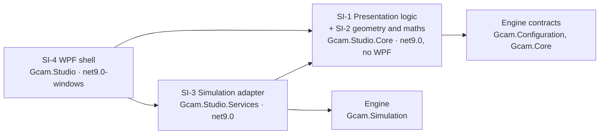
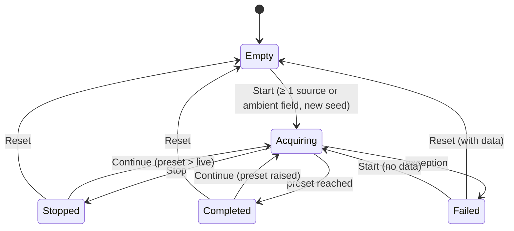
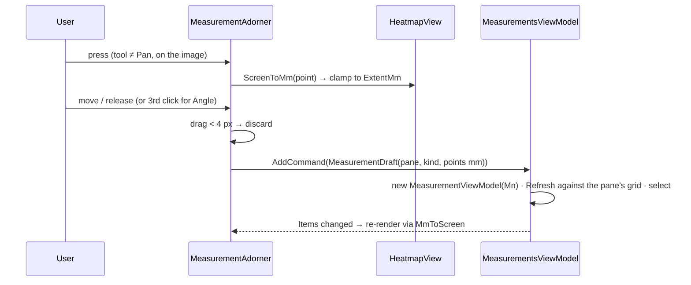

# VV.Studio.SDS — software design specification for GCAM Studio

Scope: the architecture and detailed design of the three Studio projects, as the design record that the
requirements in [VV.Studio.SRS](VV.Studio.SRS.md) are allocated to and that [VV.Studio](VV.Studio.md) verifies.
Not covered: the simulation engine (`src/Gcam.*` outside `Gcam.Studio*`, verified by `tests/Gcam.Tests`) and
the original viewer `src/Gcam.Wpf` (removed in TODO-12 (2026-10-02); last present at `85b2ed1`).

Structured after IEC 62304 §5.3 (architectural design) and §5.4 (detailed design); no compliance is claimed
([VV.Studio §1](VV.Studio.md#1-scope-and-intended-use)).

**At a glance**
- Four software items in three projects — presentation logic and view maths (`Gcam.Studio.Core`, no WPF), the
  simulation adapter (`Gcam.Studio.Services`, the only layer that reaches the engine) and the WPF shell — split into
  26 units (§2); the compiler enforces the layering.
- Interfaces between items (§3), SOUP with what Studio relies on (§4), the run state machine and the measurement
  gesture (§5), and the detailed design of each unit (§6).
- Every SRS requirement is allocated to the unit that meets it (§7).

**Relation to the `DESIGN.*` pages.** Those are the working guides — where code goes, how to style a view — and
they stay the place for that detail. This document is the *record*: it names every software item and unit, fixes
the interfaces between them, and ties each requirement to the unit that meets it. Where a `DESIGN.*` page already
holds the detail, it is linked, not copied.

## 1. Design overview

Three layers, each its own project, so the dependency rules are enforced by the compiler
([DESIGN.Architecture](DESIGN.Architecture.md#layers) has the full diagram and the reasons):

Key decisions and why:

| Decision | Reason | Requirements it serves |
|---|---|---|
| All logic in `net9.0` projects without WPF | testable without a UI stack; a ViewModel cannot touch a UI type | SR-ARCH-01, SR-ARCH-04 |
| Engine operations behind `IAcquisitionService` and `ISpectrumService` | the UI can be tested with fakes; the engine can change behind the contracts | SR-ARCH-02, SR-RUN-09, SR-SPEC-01 … -07 |
| Monte Carlo and decode on the thread pool, snapshots marshalled back by an async stream | the UI never blocks | SR-RUN-09, SR-RUN-17 |
| All screen ↔ mm maths in one UI-free class (`HeatmapViewport`) | one mapping, unit-tested; overlays and readout cannot disagree | SR-VIEW-01…06, SR-VIEW-05 (RC) |
| Measurements stored in mm, per pane, mapped to the screen on every render | overlays follow zoom / pan without screen state; ROI always reads the right image | SR-MEAS-04, SR-MEAS-07 |
| Colours only through `DynamicResource` tokens | runtime theme switch without restarting | SR-THEME-02, SR-ARCH-03 |

## 2. Software items and units (§5.3.1, §5.4.1)

A **software item** here is a project (or a project area); a **unit** is the smallest piece verified on its own —
one class, or a small group of types that only make sense together. Unit IDs are stable.

| Unit | Item | Type(s) | File(s) | Responsibility |
|---|---|---|---|---|
| SU-01 | SI-1 | `MainViewModel`, `RunState` | `Core/ViewModels/MainViewModel.cs` | scene list and selection, live time / speed / seed, snapshots, workspace selection, Start / Continue / Stop / Reset / failure state machine with its command table and input locks, progress, theme toggle, the ambient field input (dose rate, the dose text with its pattern validation and warning, bound, preset and environment labels) |
| SU-02 | SI-1 | `SourceItemViewModel` | `Core/ViewModels/SourceItemViewModel.cs` | one editable source; input clamping; list and marker labels; `IPlaneMarker`; → `SceneSource` |
| SU-03 | SI-1 | `MeasurementsViewModel`, `MeasureTool` | `Core/ViewModels/MeasurementsViewModel.cs`, `MeasureTool.cs` | measurement session: active tool and hint, numbering, add / delete / clear, selection, refresh on a new result |
| SU-04 | SI-1 | `MeasurementViewModel`, `MeasurementKind`, `ImagePane`, `MeasurementDraft` | `Core/ViewModels/Measurement*.cs`, `ImagePane.cs` | one measurement: point-count check, value and detail text, description for screen readers |
| SU-05 | SI-2 | `HeatmapViewport`, `Vec2`, `OverlayLabelLayout`, `ScreenRect` | `Core/Imaging/HeatmapViewport.cs`, `OverlayLabelLayout.cs`, `ScreenRect.cs` | fit, device-pixel snapping, zoom about a point, pan clamping, screen ↔ image ↔ mm; bounded packing of measured overlay rectangles |
| SU-06 | SI-2 | `MeasurementMath`, `RoiStats` | `Core/Imaging/MeasurementMath.cs` | distance, angle, ROI statistics by pixel centre |
| SU-07 | SI-1 | `IAcquisitionService`, `IAcquisitionSession`, `AcquisitionSnapshot`, `ImagingResult`, `IThemeService`, `AppTheme`, `IPlaneMarker` | `Core/Services/*.cs`, `Core/Imaging/IPlaneMarker.cs` | contracts between items (§3) |
| SU-08 | SI-3 | `SimulationService` | `Services/SimulationService.cs` | validate inputs, build the engine config (resolving the ambient preset reference from the deployed `ambient` folder through the engine loader) and start an acquisition session |
| SU-09 | SI-4 | `HeatmapView` (+ `HeatmapViewAutomationPeer`) | `Studio/Controls/HeatmapView.cs` | draw a grid with the colormap, zoom / pan input, hover readout, automation peer, exposes data range and mm mapping |
| SU-10 | SI-4 | `MeasurementAdorner`, `MeasurementOverlay` | `Studio/Controls/Measurement*.cs` | draw measurements and (display-only) source markers over a heatmap; turn gestures into `MeasurementDraft`s |
| SU-11 | SI-4 | `ColorBar`, `Colormap` | `Studio/Controls/ColorBar.cs`, `Studio/Rendering/Colormap.cs` | viridis lookup table; colour scale with ticks |
| SU-12 | SI-4 | `ThemeService` | `Studio/Services/ThemeService.cs` | swap the token dictionary in place; DWM title bar |
| SU-13 | SI-4 | `NullToCollapsedConverter`, `InverseBoolToVisibilityConverter`, `EnumMatchConverter` | `Studio/Converters/*.cs` | value → visibility / radio-button mapping |
| SU-14 | SI-4 | `MainWindow`, theme dictionaries, `ImageStackPanel`, `ImageAreaPanel` | `Studio/Views/MainWindow.xaml(.cs)`, `Studio/Themes/*.xaml`, `Studio/Controls/Image*Panel.cs` | screen layout and bindings (a square image with its legend at the drawn width; the image pair above the measurements, which take the remaining height); tokens, metrics, typography, control styles ([DESIGN.Layout](DESIGN.Layout.md), [DESIGN.Color](DESIGN.Color.md), [DESIGN.Typography](DESIGN.Typography.md), [DESIGN.Controls](DESIGN.Controls.md)) |
| SU-15 | SI-4 | `App` | `Studio/App.xaml(.cs)` | DI composition root, startup window placement, title-bar hook |
| SU-16 | SI-1 | `WorkspaceViewModel`, `ImagingWorkspaceViewModel` | `Core/ViewModels/*WorkspaceViewModel.cs` | title, automation key, active state; imaging measurements and peak over the shared result TODO-39: `CountSummary`, `FloodUnit`, `FloodCaption`, `FloodHelp`, `StripNote` from the published view; ROI units refreshed with it. |
| SU-17 | SI-2 | `PlotSeries`, `PlotBand`, `PlotMarker`, `PlotViewport`, `NiceTicks`, `MinMaxPyramid`, `PlotGeometry`, `PlotAutoScale`, `PlotBinReadout`, `PlotBandLayout`, `PlotViewRange` | `Core/Plotting/*.cs` | finite / increasing inputs, sample limit, linear / log mapping, X navigation, ticks, exact range extrema |
| SU-18 | SI-4 | `PlotView` (+ automation peer) | `Studio/Controls/PlotView.cs` | cached preparation, frozen geometry, themed axes / series / bands / markers, readout, pointer / key input, measured CPU redraw |
| SU-19 | SI-3 | `AcquisitionSession` | `Services/AcquisitionSession.cs` | fresh MC histories, consumed event prefix, live-time pacing, immutable cumulative snapshots, Stop, Continue (segments over retained state) and automatic completion |
| SU-20 | SI-3 | `SpectrumService`, `MeasurementStage` | `Services/SpectrumService.cs`, `Services/MeasurementStage.cs` | shared gain / chain response, worker binning, incremental pile-up, resolvable-line grouping and union share |
| SU-21 | SI-1 | `SpectrumWorkspaceViewModel`, `ISpectrumService`, spectrum records | `Core/ViewModels/SpectrumWorkspaceViewModel.cs`, `Core/Services/Spectrum*.cs`, `Core/Services/ISpectrumService.cs` | view settings, snapshot refresh, Histogram series / bands / table, selected window range, rejection of late responses |
| SU-22 | SI-4 | `SpectrumView`, `SpectrumPanel` | `Studio/Views/Spectrum*.xaml(.cs)` | plot, readout, table and read-only chain / view-settings panel |
| SU-23 | SI-3 | `ImagingService` | `Services/ImagingService.cs` | incremental measured windows, calibration, stripping and worker projection TODO-39: `StripCountEstimator` (signed net, pair variance with window-overlap tallies `StripRatio.OverlapCounts`, unavailable branches) and the published `StripCountEstimate`. |
| SU-24 | SI-1 | `OpticsEditorViewModel`, `OpticsPolicy`, `OpticsGeometry`, `OpticsPreset` | `Core/ViewModels/OpticsEditorViewModel.cs`, `Core/Optics/*.cs` | validated effective physical inputs, atomic presets, pure geometry and allocation policy |
| SU-25 | SI-3 | `ImagingProjection` | `Services/ImagingProjection.cs` | clone acquired config for decoder focus, one projection path for retained All/window/stripped floods TODO-39: `StripProjection` — signed difference for cross-correlation, clipped display flood, raw flood + background for MLEM, raw-support gating. |
| SU-26 | SI-1 | `AmbientPreset` | `Core/Services/AmbientPreset.cs` | the offered ambient spectra as hash-pinned references (file name + SHA-256); builds the field config; no I/O |

Paths are relative to `src/Gcam.Studio.Core`, `src/Gcam.Studio.Services` and `src/Gcam.Studio` respectively.

## 3. Interfaces between items (§5.3.2, §5.4.3)

### SI-1 ↔ SI-3: `IAcquisitionService`

`IAcquisitionService`: `Start(scene, optics, liveTimeS, speed, detector, backgroundToSignalRatio, seed)` returns an
`IAcquisitionSession`; `StartAmbient(scene, optics, liveTimeS, speed, ambient, detector, backgroundToSignalRatio, seed)` starts
an acquisition with an absolute ambient field, including an empty scene (SR-RUN-29). The session publishes `IAsyncEnumerable<AcquisitionSnapshot>`, exposes `Stop()` and `Continue(liveTimeS, speed)` and supports
asynchronous disposal. Snapshots contain live time, integer counts, running rate, achieved speed, MC-limited
flag, imaging, unsmeared events, frozen detector and effective physical optics inputs, decode time and completion. Images are detached read-only copies; the event
array is detached and wrapped read-only. A bounded channel keeps at most two cumulative snapshots and drops
old snapshots for a slow reader; it never drops acquired events. The ViewModel awaits on its UI context.
`TimeProvider` is injected into the service for virtual-clock verification. Stop cancels transport and waiting,
then publishes the terminal snapshot. A look-ahead event beyond the target proves the preceding empty interval.

| Aspect | Contract |
|---|---|
| Threading | Argument checks and config build run synchronously on the caller's thread; session transport and decoding run on the thread pool. Snapshots are consumed on the caller's context. |
| Progress | Snapshot live time / preset, from sequential cumulative snapshots. |
| Stop | Cooperative cancellation of transport and waiting, followed by a terminal snapshot retaining acquired data. |
| Errors | Exceptions propagate through the snapshot stream; the ViewModel converts them to Failed (SR-RUN-03). |
| Result | `ImagingResult(Flood, FloodOriginMm, FloodStepMm, Reconstruction?, ReconOriginMm, ReconStepMm, Estimate?, EffectiveCounts, Elapsed)`. Both grids: pixel i centred at `origin + i·step` mm, row 0 at the bottom. Flood origin = `−(N−1)/2 · pixelPitch`; `EffectiveCounts` is the integer acquired-event count; `Elapsed` is wall time. |

`SceneConfigBuilderTests` verifies scene-to-config mapping in the engine suite. `AcquisitionServiceTests`
verifies transport/localization, immutable snapshots, count conservation, input checks, pacing and Stop.

### SI-1 ↔ SI-3: `ISpectrumService`

`ProcessAsync(acquisitionId, events, lines, settings, seed, cancellationToken)` returns `SpectrumView`:
1001 explicit bin edges (0–2000 keV), 1000 centres and acquired counts, grouped bands and their counts / shares, total measured pulses, overflow,
union share, resolution at 662 keV, resolving time, chain name and worker processing elapsed time.
`SpectrumSettings` contains a positive finite N and pile-up, plus the snapshot's frozen DetectorSettings and
pixel dimensions; log Y is a plot property. Gain σ and seed belong to acquisition inputs, not to the editable
view; the response therefore survives later input edits.
Requests are serialized and CPU work runs in `Task.Run`. The ViewModel resumes on its calling context;
cancellation and a revision check prevent an old request from overwriting a newer view. Failure is shown as
`Spectrum failed: …` without discarding the acquisition. Published plot arrays are never subsequently mutated.

### SI-1 ↔ SI-4: `IThemeService`

`AppTheme Current { get; }` and `void Apply(AppTheme)`. Apply is synchronous on the UI thread; it throws
`InvalidOperationException` if no `Themes/Tokens.*.xaml` dictionary is merged (a build-time configuration error,
not a user-reachable state).

### SI-1 ↔ SI-4: bindings and the overlay

| Direction | Mechanism | Payload |
|---|---|---|
| View → ViewModel | commands | `StartCommand` (Start / Continue), `StopCommand`, `ResetCommand`, `AddSourceCommand`, `RemoveSourceCommand`, `ToggleThemeCommand`; `Measurements.AddCommand(MeasurementDraft)`, `DeleteCommand`, `ClearCommand` |
| View ↔ ViewModel | two-way bindings | source fields, live time, speed, selected source, selected measurement, `ActiveTool` (radio group through `EnumMatchConverter`) |
| ViewModel → View | one-way bindings | `Result` (images and mm mapping), `Progress`, `Status`, `State`, `IsIdle`, `CanEditInputs`, `CanEditLiveTime`, `CanEditSpeed`, `StartLabel`, `PeakText`, `ThemeToggleLabel`, `ToolHint`, `Items` |
| Overlay → ViewModel | attached properties on `HeatmapView` (`MeasurementOverlay.Session`, `Pane`, `Markers`, `SelectedMarker`, `CanMoveMarkers`) | the adorner reads the session's tool and items and sends `MeasurementDraft(Pane, Kind, PointsMm)` through `AddCommand`; Studio sets `CanMoveMarkers = False`, so source markers are display-only |
| Control → sibling | read-only dependency properties bound by `ElementName` | `HeatmapView.DataMin` / `DataMax` → `ColorBar`; `HeatmapView.Readout` |

`IPlaneMarker` (`MarkerLabel`, `X`, `Y`) lets SU-10 move a scene source without knowing it is a
`SourceItemViewModel`. All coordinates crossing these interfaces are in the pane's **mm** frame; screen pixels never
leave SI-4.

### SI-4 ↔ operating system

| Interface | Used for | Failure handling |
|---|---|---|
| WPF resource system | theme tokens, styles | missing token dictionary → exception at switch (see above) |
| `dwmapi.DwmSetWindowAttribute` (attr. 20), `user32.SetWindowPos` | title bar colour and repaint | return values ignored: best effort (SR-ENV-01) |
| UI Automation (`AutomationProperties`, `HeatmapViewAutomationPeer`) | screen readers, scripted checks | — |
| `SystemParameters.WorkArea` | maximise on small screens (SR-ENV-02) | — |

## 4. SOUP and required platform (§5.3.3, §5.3.4)

| SOUP | Version | Used by | What Studio relies on | Not relied on |
|---|---|---|---|---|
| .NET runtime + WPF | 9.0 (SDK 9.0.311 at the last record) | all | `Task.Run`, async streams, channels, `TimeProvider`, `CancellationToken`, WPF binding / resources / adorners / automation | — |
| CommunityToolkit.Mvvm | 8.4.0 | SI-1 | `[ObservableProperty]` change notification, `[RelayCommand]` and `CanExecute` re-query on `NotifyCanExecuteChangedFor` | messaging, validation |
| Microsoft.Extensions.DependencyInjection | 9.0.0 | SU-15 | singleton registration and resolution | scopes, lifetimes beyond singleton |
| xUnit | 2.9.2 | tests only | — not part of the shipped app | — |

Hardware: a Windows PC; the Monte Carlo is CPU-bound and single-run (no GPU). No known SOUP anomaly affects the
listed uses; none was searched for beyond the package release notes. The engine projects are first-party, not SOUP,
and are verified by their own suite.

## 5. Segregation and run-time structure (§5.3.5)

- **Compile-time segregation**: target frameworks and project references (§1). The shell could still reach the
  engine transitively through SI-3 — tracked as AN-08 in [VV.Studio §6](VV.Studio.md#anomalies-and-gaps).
- **Thread segregation**: SU-08 / SU-19's worker runs off the UI thread, and it touches no ViewModel. Every
  ViewModel member is read and written on the UI thread.
- No safety-related segregation is needed: no unit controls anything outside the process.

### Run state machine (SU-01)

The command table is computed from three facts: `IsRunning`, `HasData` (`Snapshot ≠ null`) and whether a
continuable session is held. `CanEditInputs = !IsRunning && !HasData` gates every physical input (sources,
optics, gap, gain, BSR, ambient dose rate and bound, chain, seed); `CanEditLiveTime = !IsRunning && (!HasData || session held)`;
`CanEditSpeed = !IsRunning`. Start reads "Continue" with data and is enabled only when the preset exceeds the
acquired live time; Reset only with data and not while running. The guards are repeated inside the commands and
in every physical setter (a refused change is reverted), so the locks hold for any writer, not only for the
disabled controls (SR-RUN-12). Start draws the seed, freezes the scene in the workspaces (`Begin`) and starts a
session; Continue calls `IAcquisitionSession.Continue(preset, speed)` on the held session and does not `Begin`
the workspaces, so they keep appending under one acquisition id. Reset disposes the session and clears the
snapshot, result and workspace views (Imaging also forgets its frozen scene, so geometry follows the pending
optics again); measurement shapes stay. A failure disposes the session: with data the inputs stay locked and only
Reset is offered; without data the inputs are editable. `IsRunning` resets in `finally`.

### Measurement gesture (SU-10 → SU-03)

## 6. Detailed design of units (§5.4.2)

Only the rules a reviewer needs to check a requirement; the rest is in the code and its comments.

### SU-05 `HeatmapViewport`

| Rule | Definition |
|---|---|
| Fit scale | `raw = min(viewW / imgW, viewH / imgH)`. With snapping and `raw·ppd ≥ 1`: `floor(raw·ppd) / ppd` (whole device pixels per cell, `ppd` = pixels per DIP). |
| Scale | `fit · zoom`, zoom ∈ [1, 32]. |
| Zoom about anchor *a* | image point `q = (a − offset)/scale` kept fixed: `offset' = clamp(a − q·scale')`; reaching zoom 1 calls `Reset()` (centred fit). |
| Pan clamp, per axis | image smaller than view → centred; otherwise `offset ∈ [view − size, 0]`. |
| Screen → image | `p = (s − offset)/scale`, then `y = H − p.y` (row 0 at the bottom); pixel centres at `i + 0.5`. |
| Image → mm | `mm = origin + (img − 0.5)·step`; inverse `img = (mm − origin)/step + 0.5`. |
| Configure | image size changed, or zoom already 1 → reset to fit; otherwise keep zoom and re-clamp. |

### SU-06 `MeasurementMath`

| Function | Definition |
|---|---|
| `Distance(a, b)` | Euclidean length. |
| `AngleDeg(a, v, b)` | `acos(clamp(û·v̂, −1, 1))` in degrees at vertex `v`; 0 if either arm has zero length. |
| `Roi(img, A, B, origin, step)` | rectangle `[min, max]` of the two corners; pixel range `ceil((min − origin)/step) … floor((max − origin)/step)`, clipped to `[0, N−1]`; whole pixels whose **centre** is inside; returns count, sum, mean, max (all zero if none; zero if `step ≤ 0`). Whole pixels because a flood pixel is one crystal. |

### SU-01 `MainViewModel`

| Rule | Definition |
|---|---|
| Progress | acquisition live time / preset, from sequential cumulative snapshots. |
| Input locks | physical setters revert any change while `HasData` or `IsRunning`; a preset below the acquired live time is reverted with `LiveTimeError`; speed reverts only while running. |
| Seed | blank `SeedText` draws `Random.Shared.Next(1, int.MaxValue)` per new acquisition; a nonnegative integer is used as given; `AcquisitionSeed` holds the acquisition's seed until Reset. |
| Inputs | default 60 s and ×10; invalid non-positive / non-finite UI values return to defaults; service rejects them. |
| Ambient dose | default 0.10 µSv/h, front-only bound; `AmbientDoseText` must match `AmbientDosePatternText` (digits with at most one decimal point); any other text is refused: the dose rate keeps its previous value, `AmbientDoseError` shows under the field and Start does nothing until it is corrected; a non-finite or negative value set in code is reverted to the previous value. 0 calls the ideal `Start`, any other value `StartAmbient` with `AmbientPreset.Field(dose, bound)`. |
| Add source | new source at `X = 15 mm · count`, `Y = 0`, selected. |
| Remove source | select the item now at the removed index, or the new last item; `null` when empty. |
| Status text | `"t = {live:F1} s of {preset:G} s · {counts:N0} counts · {counts / live:F0} cps · seed {seed}"` (observed rate); MC-limited appends achieved speed; terminal text prefixes Stopped / Completed; Reset shows "Ready". |

### SU-19 `AcquisitionSession`

The flood adds one count per ComptonCrystalDetector event located by Argmax. This replaces the pre-list-mode
geometric CrystalDetector (DefaultSimulationFactory) flood and includes in-crystal Compton scatter
mispositioning. No size of that effect is asserted here.

Each 250 ms refresh spends at most 200 ms transporting fresh histories, then decodes the accumulated flood
off-thread. Physical rate is total emission × sum of detected importance weights / emitted histories.
Rejection uses A/(4πz_min²), a proven detector-area weight bound; analog emission uses bound 1. Timing and
rejection have independent seeded RNG streams. The MC-limited horizon is the consumed prefix, not an unconsumed
accepted event. Events past the preset are look-ahead only. Background uses a separately timed process at
BSR × source rate, whose fresh deposits use the existing cosine-flux unmasked crystal response. A uniform
pixel assignment follows the engine's detected-pedestal model, not a transported shield profile. BSR is a
detected-count ratio, not an incident-flux prediction; entrance, backing and reflector effects apply to source
transport, while the BSR background response matches `BackgroundDepositSpectrum`. Disabled background consumes no
additional source RNG draws. Nuclear emissions remain independent singles.

An absolute ambient field (SR-RUN-29) is a separate, source-independent process: dose rate and bound plus the preset
reference are frozen at Start; SU-08 resolves the reference from `<application>/ambient/` with the engine's
`ConfigLoader.ResolveAmbientSpectrum`, which checks the bytes against the SHA-256 pinned in SU-26, and the engine
refuses a spectrum that is not validated. The session then advances by fixed live-time targets, so empty intervals
progress and a source-free acquisition is possible. A field of 0 takes the ideal path and consumes no RNG draws.

The session runs in segments: Start runs the first, each `Continue(preset, speed)` one more, on a fresh worker,
channel and stop token. Everything a continuation needs lives in fields — the `ListModeSource` with all its RNG
streams, the one already-drawn look-ahead event (dropping it at Stop would lose a real count), the events, flood,
decoder and live time — so a stopped and continued acquisition produces, event for event, the uninterrupted one.
A segment's first refresh republishes the retained state; its wall-clock references start at the segment, so
live time never advances while stopped. `ReadSnapshotsAsync` awaits its worker before completing, so the next
segment starts only after the previous one left the shared state. `Continue` rejects a running segment, a failed
session and a preset not above the acquired live time. Snapshots carry the acquisition seed.

### SU-16 workspaces / SU-17 plotting / SU-18 `PlotView`

The shell registers Imaging once and retains its identity on completion, Stop and failure. `Shared.Result`
is the acquisition source of truth; publishing it refreshes the imaging measurement session and notifies `PeakText`,
which names the decoder estimate for one found peak and counts the found peaks when there are two or more.
The two `ContentControl`s use workspace-type DataTemplates for centre and panel. Only registered indices are
selected by Ctrl+1…4; switch visibility requires at least two workspaces.
Setting a registered workspace's `IsActive` true selects it in the shell and clears the other active state.
This handles SelectionItem activation without relying on a button command (AN-10).

Plot data arrays are immutable after publication. A series validates finite values, a strictly increasing X axis
or positive sample step, and a 10M input cap. The pyramid stores extrema for complete dyadic blocks starting at 64 samples
(at most N/16 extra doubles); range queries use the largest aligned block wholly within the requested half-open
interval and scan raw samples only for head / tail block fragments, so edge extrema are exact. Empty columns
carry no fabricated data. Linear / log viewport transformations and tick labels remain UI-free.

`PlotView` prepares data on `Series` replacement. Resizing / navigation reuse preparation and issue one frozen
geometry per series (column extrema); Area fills to zero, or one count on log Y. Dynamic brushes are set by the
theme style. The control exposes a read-only readout for a host TextBlock (line readout does not redraw; histogram bin changes redraw the cursor),
input parity and an Image automation peer. Axis margins and centred X ticks use measured text dimensions. CPU `OnRender`
timing includes axes, query and geometry; the desktop test separately records event-to-render delay.

`PlotGeometry` emits two points per visible histogram bin (clipped to X) at widths of at least two device
pixels; otherwise it queries bins intersecting each device column through the pyramid. The existing line
column query stays bounded by resolution. `PlotViewport.Configure` resets only on full-range change.
`PlotAutoScale` applies visible extrema and headroom; `PlotView` retains the previous top for same-range data
updates, recomputing on navigation / log change. `PlotBinReadout` reports real half-open bin bounds.
`PlotBandLayout` takes measured widths and returns clamped positions and collision rows; `PlotView` places those rows
in a label strip above the plot area (laid out first: x positions depend only on the plot's left edge and width) and
ellipsizes text wider than the plot on one line. Marker labels carry a leader to their line and can be hidden per
plot. Linear tick labels take their decimals from the tick step and group thousands (`TickFormatter.StepLabels`);
continuous readings use four significant digits (`NumberFormat.Significant`). A one-way `ViewRange` requests X navigation. Offscreen verification uses a separate
opt-in STA test project, with base WPF resource infrastructure but no Studio App startup or desktop input.

### SU-20 … SU-22 Spectrum

The default chain comes from Configuration `FrontEndParts.Default`: GAGG(Ce), Hamamatsu MPPC S13360-3050,
CSP + CR-RC. `FrontEndModel` derives resolution from the photoelectron budget, intrinsic floor and DCR.
The shared pulse helper gives 11.25 / 40 ADC samples at 125 MSPS; `ResolvingSamples` gives 730 ns.
Each retained MC deposit is multiplied by its fixed pixel gain and smeared once, using a seed addressed by its
event index. `MeasurementStage` obtains the `CrystalUniformity.Gain` pattern from the acquisition settings;
it supplies the same deterministic response to spectrum and future energy-window images. Singles extend the
histogram; pile-up sums gained amplitudes while each arrival gap is below 730 ns, re-extending the interval as the
engine's `ApplyPileUp` does. The final open group is measured on a copied histogram for publication and
stays open in the cache. A pile-up toggle resets and replays; snapshot boundaries do not change counts.
The axis is fixed at 0–2000 keV in 2 keV bins, independent of the emission lines, the ambient field and pile-up.
2 keV is finer than the 2.97 keV the old line-based axis gave at 662 keV and keeps at least 2 bins per FWHM at the
narrowest offered peak (Ba K, 4.4 keV). Pulses at or above 2000 keV are counted as overflow (Co-60 cascade sum,
pile-up sums). `IncidentMaximumEnergyKeV` only admits a source-free spectrum.

Sorted adjacent emissions merge when their separation is less than FWHM at their mean energy. Band limits
are the union span of E ± N·FWHM(E); labels retain every energy and isotope. Counts use bin centres, and
the overall share uses the union of bands, so overlapping resolved windows count a bin only once.
Spectrum follows the acquisition scene captured at Start (kept across Continue, cleared by Reset), and reprocesses
view settings without acquisition. Log Y only redraws `PlotView`. No independent pool or noise wall is added.
Acquisition snapshots retain their detector settings; gain inputs are locked while data exist, so recorded events are never resmeared.
The chain-only resolution readout excludes pixel gain spread. A Co-60 or Na-22 decay arrives as one event whose deposit is
the sum of its detected gammas (true-coincidence summing in the event itself, independent of the pile-up option); its
pixel gain is that of the event's largest-deposit pixel.
Measurements and real-engine checks are recorded in [VV.Studio](VV.Studio.md).

Spectrum publishes explicit edges from the count-binning width; centres remain for window statistics.
Table selection requests [lo - width, hi + width]. Snapshot publication matches selection by emission lines,
suppressing a second range request so live navigation survives.
SU-22's emission table uses a local shared-size scope and four shared Auto numeric columns. Header and row
cells use the same Pad.ListItem outer padding and Gap.Inline (8 DIP) inter-cell margin, retaining right alignment.

### SU-02 `SourceItemViewModel`

Distance clamped to 200–3000 mm; activity `≤ 0 → 1 µCi`; isotope not in `Isotopes.All` → first entry (Cs-137).
Any property change raises `Label`; an isotope change also raises `MarkerLabel`.

### SU-03 / SU-04 measurements

- Numbering is a session counter starting at 1; `Clear` resets it, `Delete` does not.
- A draft must have 3 points for an angle and 2 otherwise, else `ArgumentException`.
- `Refresh(result)` re-evaluates every item against its own pane's grid; distance and angle don't depend on the
  image, ROI does. No image → value "—".
- Number formats: lengths and angles `F1`; ROI amounts `N0` when |v| ≥ 100, else 3 significant digits; a
  coordinate that rounds to zero prints as `0.0`, never `-0.0`.

### SU-08 `SimulationService`

`Start` validates live time, speed and the nonempty scene, builds the config on the caller's thread with
`SceneConfigBuilder.Build(scene, optics, 1)`, clones it, applies explicit `DetectorSettings`, BSR and the acquisition seed (the builder default 12345 when none is given), and returns
SU-19 with frozen settings and the injected `TimeProvider`. `StartAmbient` also accepts an empty scene; with a field,
`BuildConfig` clones the config and resolves the preset reference on the frozen copy through
`ConfigLoader.ResolveAmbientSpectrum(config, AmbientSpectrumDirectory)`; a missing file or a wrong pin fails Start. The placeholder
photon budget is required by the config builder; acquisition ends by live time or Stop. Decoder settings come
from the builder: non-cyclic, recon half-extent `0.95 · rank · pitch / (D/F) / 2`, step
`max(0.2, pitch / (D/F) / 4)` mm, rank snapped to the nearest prime.

### SU-09 `HeatmapView`

- Colour: linear min–max of the current grid into the 256-entry viridis table (`Colormap.Viridis`); a flat grid
  uses span 1. The data range is published as `DataMin` / `DataMax` for the colour bar.
- Bitmap rows are flipped once when written, so the data's row 0 is drawn at the bottom.
- The viewport is reconfigured on new data, resize and DPI change, always with `snapToWholePixels: true`.
- Input: wheel and `+` / `−` zoom by 1.25× (keys about the centre); drag and arrows pan (arrows 40 px);
  double-click, `0`, NumPad0 and Home reset.
- Readout: `"x {F1} mm, y {F1} mm · {value:G4}"` of the hovered pixel's centre, invariant culture.
- Automation peer: Image, class name `HeatmapView`, focusable, `ItemStatus = "zoom N.Nx; <readout>"`.

### SU-10 `MeasurementAdorner` / `MeasurementOverlay`

- Input ownership: with the Pan tool the adorner is hit-test transparent except over a draggable marker, so
  pan and wheel reach the heatmap; with a measuring tool it takes the pointer and forwards the wheel.
- Constants: marker hit radius 11 px, minimum drag 4 px, marker snap 0.1 mm (`Math.Round(·, 1)`).
- A measurement must start inside the image; later points and dragged markers are clamped to the image's outer
  mm extent.
- Marker dragging is a capability of the control behind `CanMoveMarkers`; Studio sets it `False` (source positions
  are physical inputs, locked while data exist), so the marker rules above are unused in the app.
- Esc (draft open) and right-click cancel the draft; Delete on the focused heatmap runs `DeleteCommand`.
- Holds no screen geometry between renders: every render maps the mm points through `HeatmapView.MmToScreen`.
- Measures truth/found, measurement and draft chips together each render. SI-2 `OverlayLabelLayout` and
  `ScreenRect` choose bounded rectangles nearest their preferred positions with a 4-DIP gap, avoiding marker
  crosshair bounds. Resize/zoom/pan rebuild from the mm mapping; the temporary request list is cleared after
  drawing. Displaced marker labels use neutral leaders drawn before all plates. An unplaceable full chip is
  omitted; the coordinate/measurement list remains. Marker centres and hit testing are unchanged.

### SU-12 `ThemeService`

Finds the merged dictionary whose source contains `Themes/Tokens.` and replaces it **at the same index** (adding a
second dictionary would lose to the old one), then updates the title bar of every open window.

### SU-13, SU-14, SU-15

Converters are stateless singletons. `MainWindow.xaml.cs` is `InitializeComponent()` only; layout rules are in
[DESIGN.Layout](DESIGN.Layout.md) and [DESIGN.ViewLayer](DESIGN.ViewLayer.md). `App` registers every service as a
singleton ([DESIGN.Architecture](DESIGN.Architecture.md#dependency-injection)) and maximises the window when the
work area is smaller than its design size.

### SU-23 `ImagingService` and per-nuclide presentation

SU-23 belongs to SI-3 (Studio.Services). `IImagingService`, `ImagingSettings`, `ImagingChannel`, `ImagingPeak`,
`ImagingView` and `StripRatio` belong to SI-1 (Studio.Core). SU-16's ImagingWorkspaceViewModel retains the scene
and optics captured at Start, the selected isotope and strip toggle; SU-01 owns N. Production DI injects SU-23.
The optional service argument is solely compatibility for existing raw-image test harnesses.

The service serializes requests with a semaphore and performs measurement, window accumulation, H-only MC
calibration and decoding inside Task.Run. New cumulative events are measured once per worker cache and
incrementally assigned to channels. A window change re-filters the cached measured energies and recalibrates R;
strip-only and focal-only changes reuse R. Focus changes coalesce behind running preparation instead of cancelling it; acquisition replacement cancels and invalidates partial caches. SU-16 revision checks reject late
responses and refresh the selected ROI values when a view or selector changes.

Primary-line windows reuse SU-20 SpectrumService.BuildBands (including unresolved neighbours). Gains and smear
reuse MeasurementStage with the same acquisition settings and event-index seed as singles Spectrum. Spectrum's
optional pile-up is a spectrum view setting; imaging windows use measured singles. All retains the acquisition's unfiltered flood and reprojects its reconstruction at the selected decoder focus. Found peaks use MixedFieldStudy.TopPeaks with source-count k and one source-plane mask-cell
separation, then PeakInterpolation.Estimate with config.Decoder.SubCellInterpolation (default Tent).

Each contaminating isotope's complete H-only scene is cloned from the acquisition config with background
disabled. A calibration accepts 100,000 fresh list-mode events; R = low-window counts / own-primary-window
counts. Subtraction uses simultaneous raw high floods, never recursively purified floods:
max(0, low[pixel] − sum(R × high[pixel])). The model limitation is visible in the panel. Stopwatch costs
separate calibration, channel accumulation / correction, and channel decoding / peak extraction; queue delay,
acquisition transport is outside these costs; projection timing includes All-image decoding.

SU-10 draws found peaks as neutral diamonds with labelled chips; they are excluded from draggable hit testing.
SU-16 also exposes coordinate text for accessible reading. New IDs are Imaging.Channel, Imaging.Window and
Imaging.Strip. All existing control IDs remain stable. Validation status and numerical evidence are in
[VV.Studio.Imaging](VV.Studio.Imaging.md); execution is pending.

### SU-24 / SU-25 effective optics and retained-data focus

The physical editor retains numeric text, including malformed edits; only valid fields produce a new effective
OpticsSettings record. A supported-prime selector removes ambiguity about snapping. A preset loads all physical
fields once and preserves focus. Studio policy rejects finite-range, gap/pitch, source/front-face and projected
allocation violations; the engine scene builder remains unchanged. Start freezes scene, detector and optics.
The acquisition snapshot carries effective optics; the Imaging workspace also retains its Start context, never
current pending physical inputs. Validation before transport expands both physical sections and leaves an error
outside the collapsed content.

ImagingSettings.FocalDistanceMm is independent of physical OpticsSettings. ImagingProjection.AtFocus clones the
acquired config and changes only decoder plane and search grid. Sources retain their real z; physical mask
channel convergence is not edited. Project performs cross-correlation and sub-cell peak extraction identically
for All, primary-window and stripped floods. All's found marker list is the freshly projected isotope union.
An empty snapshot creates no reconstruction, peaks or calibration. NewlyMeasuredEvents exposes cache work;
a focus-only request reports zero and retains R. Spectrum is not refreshed by focus.

SU-16 coalesces revisions while one preparation is pending. It publishes only when the completed request's
revision is current, otherwise processes the latest snapshot/settings using the prepared cache. Begin cancels
old-acquisition work (Reset too); an old completion cannot change the new acquisition's view or processing state.
It refreshes without requiring a new snapshot, so Stop/Completed views can refocus. Focus validation uses acquired
D; Start additionally validates current pending physical geometry. Projection does not change the acquisition state.

SU-03 removes reconstruction-only measurements and increments ReconstructionRevision. SU-10 cancels only a
reconstruction draft on this notification; flood measurements/drafts remain. The panel explains the clearing.
The heatmap viewport stays in image coordinates while its mm mapping follows the projected grid. SU-14 uses
themed Expander.Section headers, collapsed summaries, and an independently scrollable Imaging panel.

## 7. Requirement allocation

Every SRS requirement maps to at least one unit; every unit carries at least one requirement.

| Requirement | Units |
|---|---|
| SR-OPT-01 … SR-OPT-06 | SU-01, SU-16, SU-24, SU-25, SU-23, SU-03, SU-10, SU-14 |
| SR-IMG-01 … SR-IMG-06 | SU-01 (shared N), SU-16 (ImagingWorkspaceViewModel), SU-23 (worker), SU-10 (found overlays), SU-14 (selector / options panel); SU-20 (shared window and measurement response) |
| SR-IMG-07 | SU-16 (`Reconstruction`, `ReconstructionUnit`, `ReconstructionNote`, strip count label), SU-23 (`ImagingSettings.Method`, MLEM projection with b = Σ R·high, net count), SU-25 (`Project` overload; `MlemDecoderCache`: matrices keyed by geometry and line energy, built under a lock, read concurrently), `StudioMlem` (iteration count and caveat numbers) |
| SR-RUN-01, -02, -04 … -08 | withdrawn; batch implementation removed |
| SR-RUN-03, SR-RUN-09 … SR-RUN-13, SR-RUN-19 | SU-01, SU-07, SU-08, SU-19 |
| SR-RUN-14 | withdrawn; stale marking removed |
| SR-RUN-23 … SR-RUN-28 | SU-01 (state machine, locks, seed, status), SU-19 (segments), SU-08 (seed), SU-16 (workspace reset), SU-14 (top-bar controls) |
| SR-RUN-29 | SU-01, SU-26, SU-08, SU-19, engine `AmbientPhotonProcess` |
| SR-RUN-15 | SU-08 (argument checks and engine `SceneConfigBuilder`) |
| SR-RUN-16 … SR-RUN-18 | SU-19, SU-07, SU-01, SU-16 |
| SR-RUN-20 … SR-RUN-22 | SU-08, SU-19, SU-20 (`MeasurementStage`), SU-01, engine list-mode background producer |
| SR-SCENE-01 | SU-01 (live time / speed), SU-02 |
| SR-SCENE-02 | SU-01 |
| SR-VIEW-01 … SR-VIEW-06 | SU-05, SU-09 |
| SR-VIEW-07 | SU-09 |
| SR-VIEW-08 | SU-16, SU-14 |
| SR-VIEW-09 | SU-09, SU-14 (`ImageStackPanel`) |
| SR-NAV-01 … SR-NAV-03 | SU-01, SU-16, SU-14 (type-based centre / panel templates) |
| SR-PLOT-01 … SR-PLOT-03 | SU-17, SU-18 |
| SR-PLOT-04, SR-PLOT-05 | SU-18, SU-17, SU-14 (theme styles) |
| SR-PLOT-06 ... SR-PLOT-10 | SU-17, SU-18 |
| SR-PLOT-11 | SU-18, SU-14; separate Gcam.Studio.RenderTests verification project |
| SR-SPEC-01 … SR-SPEC-05 | SU-20, SU-21, SU-22, SU-18; engine Configuration presets and `FrontEndModel` |
| SR-SPEC-06 | SU-01, SU-21, SU-22 |
| SR-SPEC-07 | SU-20, SU-21 |
| SR-SPEC-08 | SU-22, SU-18, SU-14 |
| SR-SPEC-09 | SU-20, SU-21, SU-22, SU-17, SU-18 |
| SR-MEAS-01, SR-MEAS-02 | SU-04, SU-06 |
| SR-MEAS-03 | SU-06 |
| SR-MEAS-04 | SU-01, SU-16, SU-03, SU-04 |
| SR-MEAS-05, SR-MEAS-06 | SU-03, SU-04 |
| SR-MEAS-07 | SU-10 |
| SR-MEAS-08 | withdrawn; Studio sets `CanMoveMarkers = False` |
| SR-THEME-01 | SU-01, SU-07 |
| SR-THEME-02 | SU-12, SU-14 |
| SR-ENV-01 | SU-12, SU-15 (project targets) |
| SR-ENV-02 | SU-15 |
| SR-A11Y-01, SR-A11Y-03 | SU-14, SU-09, SU-04 (row description) |
| SR-A11Y-02 | SU-09 |
| SR-A11Y-04 | SU-14 |
| SR-A11Y-05 | SU-14 theme dictionaries and disabled TextBox/ComboBox templates; ThemeContrastTests reads production XAML tokens without WPF |
| SR-SEC-01 | all (no user-file I/O in Studio), SU-08 (engine is called with in-memory config; the only file read is the shipped, hash-pinned ambient spectrum, through the engine loader) |
| SR-ARCH-01 … SR-ARCH-04 | project files of SI-1 … SI-4 and `tests/Gcam.Studio.Tests` |

SU-11 (colour bar, colormap) and SU-13 (converters) serve SR-VIEW-01 / SR-A11Y-04 and SR-MEAS-06
indirectly (presentation only); they carry no requirement of their own.

## 8. Verification of the design (§5.3.6, §5.4.4)

| Check | How | Result (2026-10-01) |
|---|---|---|
| Architecture implements the requirements and the risk controls | allocation table §7; risk controls in [VV.Studio.SRS §6](VV.Studio.SRS.md#6-risk-control-requirements-523) each map to a unit | complete |
| Layer rules hold | compiler (target frameworks, references) + inspection | hold; AN-08 (transitive reference) open |
| Interfaces are consistent | the mm convention of §3 is shared by `AcquisitionSession`, `HeatmapViewport` and `MeasurementMath` and pinned by `HeatmapViewportTests.MmMapping_PutsPixelCentresOnGrid` | consistent |
| Detailed design matches the code | each §6 rule read against the source | matches |
| Units are verifiable | SU-01 … SU-06 unit-tested; SU-07 by compilation; SU-08 by `AcquisitionServiceTests` against the real engine; SU-09 … SU-15 inspection + manual UI Automation (AN-02, AN-07) | see [VV.Studio §4](VV.Studio.md#4-verification) |

A change to a unit's rule in §6, an interface in §3 or the unit list in §2 updates this page in the same commit
as the code.

## Waveform and acquired-chain design (2026-10-02)

The detection chain is part of immutable `DetectorSettings`, captured by `SimulationService.Start` and published by `AcquisitionSession`; `AcquisitionSnapshot.Chain` exposes the captured setting. `MainViewModel` owns the part selectors and rejects physical edits while running or while data exist. Spectrum/Imaging/Measurement read snapshot settings; physical scintillators map through `FrontEndMaterials` to explicit transport keys: GAGG(Ce)→GAGG, NaI(Tl)→NaI, LYSO→LYSO, CsI(Tl)→CsI and BGO→BGO. Unsupported names fail before acquisition. GAGG remains first and default; the other materials are what-if comparisons. CsI transport uses the CsI host at 4.51 g/cm³, omitting the Tl activator as for NaI:Tl; the dopant-specific transport error is not quantified. Changing material requires Reset and a new acquisition; it never reinterprets retained deposits.

`CrystalMaterial` uses xraylib 4.3.0 photoelectric plus incoherent cross sections through 800 keV, with grid pairs around the I 33.1694 keV and Cs 35.9846 keV K edges. Above 800 keV it uses Klein–Nishina electrons/g plus the 600–800 keV photoelectric power-law extension; coherent and pair production remain omitted. CsI's measured extension error against NIST photoelectric plus incoherent is +0.069955 % at 1000 keV and −0.352789 % at 1250 keV. These are measured approximation errors, not precision guarantees. Full-precision data and checks are retained in `samples/materials/evidence/crystal_tables.json` and `samples/materials/CsI_checks.txt`; `CsIMaterialTests` verifies the like-total NIST comparisons, extension formula, reference anchor, both edges, lookup and table behavior. The existing GAGG tests remain unchanged apart from the material inventory count.

`SpectrumService` rebuilds its analytic model, effective resolving interval, measurements and bins when acquired detector identity changes. `ImagingService` invalidates energies, windows and H-only ratios on acquired detector identity as well as acquisition ID. Calibration builds the same acquired measurement chain. Array-wide Spectrum pile-up remains a sum-before-smear grouping model; Imaging still uses ungrouped event positions. Four ADC position signals and Anger mispositioning are outside this design.

`IWaveformService` returns `WaveformView`: two prepared uniform-X PlotSeries, event identity/amplitude records, acquired-chain readouts and limitation labels. `WaveformWorkspaceViewModel` owns local trigger/window/ideal/rate-study settings. It requests work only when active, cancels old requests, rejects late revisions and reuses a held window once its requested interval is covered. A new acquisition or Reset clears retained scope identity; Continue keeps it. In rate study, the retained prefix is re-spaced with a fixed seed in original order; the snapshot is never mutated.

`WaveformService` serializes requests on a semaphore and runs CPU work via Task.Run. It computes each event response once with the same index-addressed `MeasurementStage` as Spectrum/Imaging. Ideal stimulus uses gain-only amplitudes. `WindowRasterizer` is an additive engine utility with explicit sample count, clipped pulse support, optional ADC/analog noise and cancellation checks; it does not perform intrinsic smearing. `Waveform.CrrcInt`/`TrapShape` use tail-matched pole-zero coefficients. CR-RC selects the acquired preamp order (4), explicit T_sum (100/200/500 ns) and K=round(65536*order*8/T_sum); this is a simulation convention independent of the DCR effective noise integration window. CrrcInt retains F=0 legacy calls and adds F=12 states with Q16 coefficients; the signed-16 bounded contract matches 48-bit RTL states/products. Cancellation checks surround these bounded integer calls; they do not interrupt their internal loops.

`ScopeWindow` checks origin-relative time arithmetic at 125 MSPS. Twenty percent of the displayed window precedes the trigger. Warm-up includes the maximum amplitude-dependent pulse support, eight tail constants and eight times the configured sum of nominal RC times; work length including warm-up is capped at 10 million samples. Empty windows generate baseline noise. The scope labels simulated baseline beyond acquired live time and finite local filter warm-up. Uncorrected shaped baseline is displayed without BLR; CR-RC output retains Q12 fractions by dividing raw values by 4096. This finite-history reset does not reproduce an acquisition-wide trapezoidal baseline walk exactly.

The service builds plot doubles and `MinMaxPyramid` instances on the worker. A prepared pyramid is accepted only for its identical immutable sample array; the control validates implicit X endpoints and reuses the worker preparation. Existing unprepared series continue through full validation/preparation. `PlotView.ShareViewRange` publishes navigation into the scope VM's two-way ViewRange binding, so both traces share X while retaining independent Y autoscale. Views contain only InitializeComponent code-behind; the shell's templates select the two waveform controls and shared ChainPanel.

Trapezoid readout uses local FlatTop and a matched noiseless calibration. Ideal zero-rise calibration uses an explicit instantaneous reference rather than the legacy bi-exponential divide-by-zero path. Neighbor overlap, partial acquired future or saturation suppress energy recovery. CR-RC identifies its Q12 state and T_sum simulation convention and omits recovered energy because trigger/phase/overlap estimation is not validated. FWHM/readout values are engine-derived in Services, not duplicated physics formulas in Core.

Traceability and execution limitations: [VV.Studio.Waveform](VV.Studio.Waveform.md). Final tests and offscreen PNG generation were not run by the implementer after shell process creation was denied; no desktop verification is claimed.

## Detector face and independent focus worker

Core owns `DetectorFace`/`FaceRectangle`, the focus request/identity/sample/track/interval/result records,
`FocusSweepMath`, `DetectorWorkspaceViewModel` and the focus portion of `ImagingWorkspaceViewModel`.
Services implement `IDetectorFaceService` and `IFocusSweepService`; the composition root registers both.
Views select DetectorView/DetectorPanel through workspace templates. Their code-behind only initializes XAML.
`DetectorFaceView` draws exact vector rectangles with theme brushes, row zero at the bottom and an Image
automation peer. Relative gain uses opaque viridis colours and an accompanying numeric colour bar.
DetectorPanel's local surface Border has VerticalAlignment Top and keeps its ScrollViewer. Its natural
height ends after the existing captions and panel padding; the shell's stretched workspace host and face
allocation are unchanged. Gain extrema remain in DetectorWorkspaceViewModel.GainLegend beneath the face.

The face service supplies `CrystalUniformity.Gain`, exactly the pattern used by MeasurementStage. It does not
apply an energy window or label sensitivity as efficiency. The pure geometry partitions the full face into
active crystals and disjoint gap strips, including half gaps on the perimeter. With data, the acquired detector/optics
are the face source (inputs are locked); the editor is independently validated against pending pitch. The physical optics
editor validates its geometry without assuming a fixed gap; the shell and acquisition service validate the
actual gap. Invalid numeric text is retained and prevents Start.

FocusSweepIdentity contains acquisition ID, retained prefix counts/live time, channel, window N, strip state,
acquired optics/detector, K and plane count. A request captures the selected immutable flood. No scene source
count enters peak selection. Each service call runs on its own Task.Run without the acquisition or imaging
semaphore. Cancellation is checked around each bounded projection; it cannot interrupt the decoder's internal
loop. No caller awaits focus from the acquisition loop. Later snapshots can continue acquisition while the
analysis retains its explicitly labelled prefix; replacement acquisition and analysis-setting edits invalidate
the revision, cancel the token and clear old results. A returned identity must equal the request before publication.

The default 81 planes interpolate 1/z between 1/(D+30) and 1/3000. Every plane passes Studio's grid validation.
AtFocus clones projection configuration; transport is absent. Each peak's metric is (grid peak−mean)/population
standard deviation over its reconstruction. Zero variance has no defined prominence. For K≤4 an exhaustive
minimum-cost one-to-one assignment links nearest previous heads using squared x/z,y/z displacement. This is
descriptive tracking, not a source-resolution guarantee; tracks missing any plane are omitted as unresolved.
The raw half-maximum interval is the connected component containing the largest sampled prominence, with
linear interpolation in mm at crossings. Sweep-edge reach censors that endpoint. Disconnected components,
boundary maxima and empty complete-track sets are explicit. No standard error, statistical significance or
fusion threshold is computed. External range has no effect until Use as focus is invoked.

| Requirement allocation | Units / files |
|---|---|
| SR-DET-01 | MainViewModel, OpticsEditorViewModel, SimulationService; shared left-panel editor |
| SR-DET-02…04 | DetectorWorkspaceViewModel, DetectorFace, DetectorFaceService, DetectorFaceView, DetectorView/Panel, offscreen fixtures |
| SR-FOCUS-01…02 | IFocusSweepService, FocusSweepService, FocusSweepMath, ImagingProjection |
| SR-FOCUS-03…05 | FocusInterval/Track, ImagingWorkspaceViewModel.Focus, FocusSweepView and ImagingOptionsPanel; existing PlotView |

Execution evidence and known algorithm limits: [VV.Studio.Detector](VV.Studio.Detector.md).
