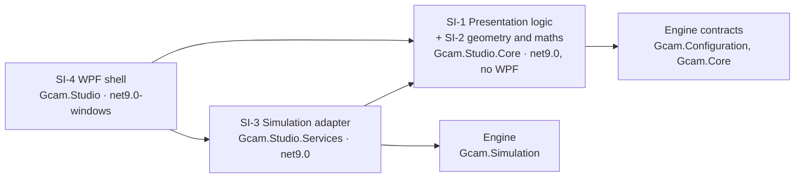
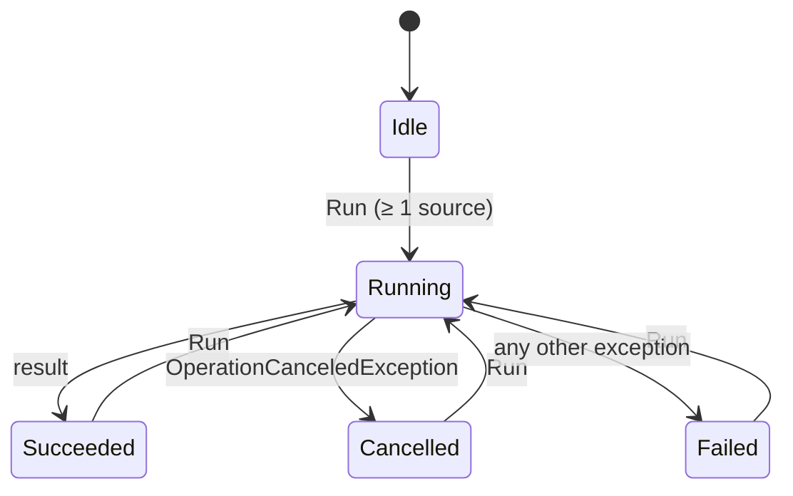
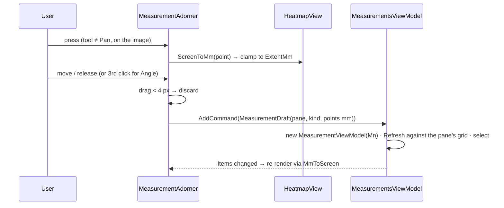

# VV.Studio.SDS — software design specification for GCAM Studio

Scope: the architecture and detailed design of the three Studio projects, as the design record that the
requirements in [VV.Studio.SRS](VV.Studio.SRS.md) are allocated to and that [VV.Studio](VV.Studio.md) verifies.
Not covered: the simulation engine (`src/Gcam.*` outside `Gcam.Studio*`, verified by `tests/Gcam.Tests`) and
`src/Gcam.Wpf`.

Structured after IEC 62304 §5.3 (architectural design) and §5.4 (detailed design); no compliance is claimed
([VV.Studio §1](VV.Studio.md#1-scope-and-intended-use)).

**At a glance**
- Four software items in three projects — presentation logic and view maths (`Gcam.Studio.Core`, no WPF), the
  simulation adapter (`Gcam.Studio.Services`, the only layer that reaches the engine) and the WPF shell — split into
  15 units (§2); the compiler enforces the layering.
- Interfaces between items (§3), SOUP with what Studio relies on (§4), the run state machine and the measurement
  gesture (§5), and the detailed design of each unit (§6).
- Every SRS requirement is allocated to the unit that meets it (§7).

**Relation to the `DESIGN.*` pages.** Those are the working guides — where code goes, how to style a view — and
they stay the place for that detail. This document is the *record*: it names every software item and unit, fixes
the interfaces between them, and ties each requirement to the unit that meets it. Where a `DESIGN.*` page already
holds the detail, it is linked, not copied.

## 1. Design overview

Three layers, each its own project, so the dependency rules are enforced by the compiler
([DESIGN.Architecture](DESIGN.Architecture.md#layers) has the full diagram and the reasons):



Key decisions and why:

| Decision | Reason | Requirements it serves |
|---|---|---|
| All logic in `net9.0` projects without WPF | testable without a UI stack; a ViewModel cannot touch a UI type | SR-ARCH-01, SR-ARCH-04 |
| One engine entry point, `ISimulationService` | the UI can be tested with a fake; the engine can change behind the contract | SR-ARCH-02, SR-RUN-01 |
| Monte Carlo on the thread pool, results marshalled back by `async` / `Progress<T>` | the UI never blocks | SR-RUN-01, SR-RUN-04 |
| All screen ↔ mm maths in one UI-free class (`HeatmapViewport`) | one mapping, unit-tested; overlays and readout cannot disagree | SR-VIEW-01…06, SR-VIEW-05 (RC) |
| Measurements stored in mm, per pane, mapped to the screen on every render | overlays follow zoom / pan without screen state; ROI always reads the right image | SR-MEAS-04, SR-MEAS-07 |
| Colours only through `DynamicResource` tokens | runtime theme switch without restarting | SR-THEME-02, SR-ARCH-03 |

## 2. Software items and units (§5.3.1, §5.4.1)

A **software item** here is a project (or a project area); a **unit** is the smallest piece verified on its own —
one class, or a small group of types that only make sense together. Unit IDs are stable.

| Unit | Item | Type(s) | File(s) | Responsibility |
|---|---|---|---|---|
| SU-01 | SI-1 | `MainViewModel`, `RunState` | `Core/ViewModels/MainViewModel.cs` | scene list and selection, photon budget, run / cancel / failure state machine, progress guard, stale flag, peak text, theme toggle |
| SU-02 | SI-1 | `SourceItemViewModel` | `Core/ViewModels/SourceItemViewModel.cs` | one editable source; input clamping; list and marker labels; `IPlaneMarker`; → `SceneSource` |
| SU-03 | SI-1 | `MeasurementsViewModel`, `MeasureTool` | `Core/ViewModels/MeasurementsViewModel.cs`, `MeasureTool.cs` | measurement session: active tool and hint, numbering, add / delete / clear, selection, refresh on a new result |
| SU-04 | SI-1 | `MeasurementViewModel`, `MeasurementKind`, `ImagePane`, `MeasurementDraft` | `Core/ViewModels/Measurement*.cs`, `ImagePane.cs` | one measurement: point-count check, value and detail text, description for screen readers |
| SU-05 | SI-2 | `HeatmapViewport`, `Vec2` | `Core/Imaging/HeatmapViewport.cs` | fit, device-pixel snapping, zoom about a point, pan clamping, screen ↔ image ↔ mm |
| SU-06 | SI-2 | `MeasurementMath`, `RoiStats` | `Core/Imaging/MeasurementMath.cs` | distance, angle, ROI statistics by pixel centre |
| SU-07 | SI-1 | `ISimulationService`, `ImagingResult`, `IThemeService`, `AppTheme`, `IPlaneMarker` | `Core/Services/*.cs`, `Core/Imaging/IPlaneMarker.cs` | contracts between items (§3) |
| SU-08 | SI-3 | `SimulationService` | `Services/SimulationService.cs` | build the engine config, run it off the UI thread, return both grids with their mm mapping |
| SU-09 | SI-4 | `HeatmapView` (+ `HeatmapViewAutomationPeer`) | `Studio/Controls/HeatmapView.cs` | draw a grid with the colormap, zoom / pan input, hover readout, automation peer, exposes data range and mm mapping |
| SU-10 | SI-4 | `MeasurementAdorner`, `MeasurementOverlay` | `Studio/Controls/Measurement*.cs` | draw measurements and source markers over a heatmap; turn gestures into `MeasurementDraft`s; marker drag |
| SU-11 | SI-4 | `ColorBar`, `Colormap` | `Studio/Controls/ColorBar.cs`, `Studio/Rendering/Colormap.cs` | viridis lookup table; colour scale with ticks |
| SU-12 | SI-4 | `ThemeService` | `Studio/Services/ThemeService.cs` | swap the token dictionary in place; DWM title bar |
| SU-13 | SI-4 | `NullToCollapsedConverter`, `InverseBoolToVisibilityConverter`, `EnumMatchConverter` | `Studio/Converters/*.cs` | value → visibility / radio-button mapping |
| SU-14 | SI-4 | `MainWindow`, theme dictionaries | `Studio/Views/MainWindow.xaml(.cs)`, `Studio/Themes/*.xaml` | screen layout and bindings; tokens, metrics, typography, control styles ([DESIGN.Layout](DESIGN.Layout.md), [DESIGN.Color](DESIGN.Color.md), [DESIGN.Typography](DESIGN.Typography.md), [DESIGN.Controls](DESIGN.Controls.md)) |
| SU-15 | SI-4 | `App` | `Studio/App.xaml(.cs)` | DI composition root, startup window placement, title-bar hook |

Paths are relative to `src/Gcam.Studio.Core`, `src/Gcam.Studio.Services` and `src/Gcam.Studio` respectively.

## 3. Interfaces between items (§5.3.2, §5.4.3)

### SI-1 ↔ SI-3: `ISimulationService`

```csharp
Task<ImagingResult> RunAsync(IReadOnlyList<SceneSource> scene, OpticsSettings optics, long photons,
                             IProgress<double>? progress, CancellationToken cancellationToken);
```

| Aspect | Contract |
|---|---|
| Threading | Argument checks and the config build run **synchronously on the caller's thread** (bad input fails before any work starts); the transport runs on the thread pool. Progress is reported through the caller's `IProgress<double>`, so it is posted to the UI thread. |
| Progress | 0 … 1, reported every 4096 photons by the engine; not guaranteed to arrive before the task completes (SU-01 guards). |
| Cancellation | Cooperative: the engine checks the token and throws `OperationCanceledException`. |
| Errors | Any other exception propagates through the task; the caller converts it to state (SR-RUN-03). |
| Result | `ImagingResult(Flood, FloodOriginMm, FloodStepMm, Reconstruction?, ReconOriginMm, ReconStepMm, Estimate?, EffectiveCounts, Elapsed)`. Both grids: pixel *i* centred at `origin + i·step` mm, row 0 at the bottom. Flood origin = `−(N−1)/2 · pixelPitch` (detector centred on the axis). `EffectiveCounts` = `DetectedWeight` (physical count), not the raw hit count. |

The engine side (`SceneConfigBuilder.Build`, `SimulationRunner.Run(config, progress, ct)`) is verified by
`SceneConfigBuilderTests` in the engine suite; the service itself — same run as the engine for the same scene, the
flood axis on the decoder's pixel centres, argument errors before any work is scheduled, progress, cancellation —
by `SimulationServiceTests` against the real engine.

### SI-1 ↔ SI-4: `IThemeService`

`AppTheme Current { get; }` and `void Apply(AppTheme)`. Apply is synchronous on the UI thread; it throws
`InvalidOperationException` if no `Themes/Tokens.*.xaml` dictionary is merged (a build-time configuration error,
not a user-reachable state).

### SI-1 ↔ SI-4: bindings and the overlay

| Direction | Mechanism | Payload |
|---|---|---|
| View → ViewModel | commands | `RunCommand` / `RunCancelCommand`, `AddSourceCommand`, `RemoveSourceCommand`, `ToggleThemeCommand`; `Measurements.AddCommand(MeasurementDraft)`, `DeleteCommand`, `ClearCommand` |
| View ↔ ViewModel | two-way bindings | source fields, photon budget, selected source, selected measurement, `ActiveTool` (radio group through `EnumMatchConverter`) |
| ViewModel → View | one-way bindings | `Result` (images and mm mapping), `Progress`, `Status`, `State`, `IsIdle`, `IsResultStale`, `PeakText`, `ThemeToggleLabel`, `ToolHint`, `Items` |
| Overlay → ViewModel | attached properties on `HeatmapView` (`MeasurementOverlay.Session`, `Pane`, `Markers`, `SelectedMarker`, `CanMoveMarkers`) | the adorner reads the session's tool and items, sends `MeasurementDraft(Pane, Kind, PointsMm)` through `AddCommand`, and writes `X` / `Y` of an `IPlaneMarker` while dragging |
| Control → sibling | read-only dependency properties bound by `ElementName` | `HeatmapView.DataMin` / `DataMax` → `ColorBar`; `HeatmapView.Readout` |

`IPlaneMarker` (`MarkerLabel`, `X`, `Y`) lets SU-10 move a scene source without knowing it is a
`SourceItemViewModel`. All coordinates crossing these interfaces are in the pane's **mm** frame; screen pixels never
leave SI-4.

### SI-4 ↔ operating system

| Interface | Used for | Failure handling |
|---|---|---|
| WPF resource system | theme tokens, styles | missing token dictionary → exception at switch (see above) |
| `dwmapi.DwmSetWindowAttribute` (attr. 20), `user32.SetWindowPos` | title bar colour and repaint | return values ignored: best effort (SR-ENV-01) |
| UI Automation (`AutomationProperties`, `HeatmapViewAutomationPeer`) | screen readers, scripted checks | — |
| `SystemParameters.WorkArea` | maximise on small screens (SR-ENV-02) | — |

## 4. SOUP and required platform (§5.3.3, §5.3.4)

| SOUP | Version | Used by | What Studio relies on | Not relied on |
|---|---|---|---|---|
| .NET runtime + WPF | 9.0 (SDK 9.0.311 at the last record) | all | `Task.Run`, `Progress<T>` (posts to the captured context), `CancellationToken`, WPF binding / resources / adorners / automation | — |
| CommunityToolkit.Mvvm | 8.4.0 | SI-1 | `[ObservableProperty]` change notification, `[RelayCommand]` incl. `IncludeCancelCommand` and `CanExecute` re-query on `NotifyCanExecuteChangedFor` | messaging, validation |
| Microsoft.Extensions.DependencyInjection | 9.0.0 | SU-15 | singleton registration and resolution | scopes, lifetimes beyond singleton |
| xUnit | 2.9.2 | tests only | — not part of the shipped app | — |

Hardware: a Windows PC; the Monte Carlo is CPU-bound and single-run (no GPU). No known SOUP anomaly affects the
listed uses; none was searched for beyond the package release notes. The engine projects are first-party, not SOUP,
and are verified by their own suite.

## 5. Segregation and run-time structure (§5.3.5)

- **Compile-time segregation**: target frameworks and project references (§1). The shell could still reach the
  engine transitively through SI-3 — tracked as AN-08 in [VV.Studio §6](VV.Studio.md#anomalies-and-gaps).
- **Thread segregation**: only SU-08's `Task.Run` body runs off the UI thread, and it touches no ViewModel. Every
  ViewModel member is read and written on the UI thread.
- No safety-related segregation is needed: no unit controls anything outside the process.

### Run state machine (SU-01)



While `Running`: `IsRunning = true`, `IsIdle = false` → add / remove source, photon box and marker drag disabled
(SR-RUN-05). On `Succeeded` only: `Result` replaced, `IsResultStale = false`, `Progress = 1`. On `Cancelled` /
`Failed`, `Result` is untouched. `IsRunning` is reset in `finally`.

### Measurement gesture (SU-10 → SU-03)



## 6. Detailed design of units (§5.4.2)

Only the rules a reviewer needs to check a requirement; the rest is in the code and its comments.

### SU-05 `HeatmapViewport`

| Rule | Definition |
|---|---|
| Fit scale | `raw = min(viewW / imgW, viewH / imgH)`. With snapping and `raw·ppd ≥ 1`: `floor(raw·ppd) / ppd` (whole device pixels per cell, `ppd` = pixels per DIP). |
| Scale | `fit · zoom`, zoom ∈ [1, 32]. |
| Zoom about anchor *a* | image point `q = (a − offset)/scale` kept fixed: `offset' = clamp(a − q·scale')`; reaching zoom 1 calls `Reset()` (centred fit). |
| Pan clamp, per axis | image smaller than view → centred; otherwise `offset ∈ [view − size, 0]`. |
| Screen → image | `p = (s − offset)/scale`, then `y = H − p.y` (row 0 at the bottom); pixel centres at `i + 0.5`. |
| Image → mm | `mm = origin + (img − 0.5)·step`; inverse `img = (mm − origin)/step + 0.5`. |
| Configure | image size changed, or zoom already 1 → reset to fit; otherwise keep zoom and re-clamp. |

### SU-06 `MeasurementMath`

| Function | Definition |
|---|---|
| `Distance(a, b)` | Euclidean length. |
| `AngleDeg(a, v, b)` | `acos(clamp(û·v̂, −1, 1))` in degrees at vertex `v`; 0 if either arm has zero length. |
| `Roi(img, A, B, origin, step)` | rectangle `[min, max]` of the two corners; pixel range `ceil((min − origin)/step) … floor((max − origin)/step)`, clipped to `[0, N−1]`; whole pixels whose **centre** is inside; returns count, sum, mean, max (all zero if none; zero if `step ≤ 0`). Whole pixels because a flood pixel is one crystal. |

### SU-01 `MainViewModel`

| Rule | Definition |
|---|---|
| Progress guard | accept a report only if `IsRunning` and `p > Progress`. |
| Stale flag | set when `Result ≠ null` and the source collection changes or any source property except `Label` / `MarkerLabel` changes; cleared only on success. |
| Photon clamp | `Photons < 1,000 → 1,000` in the property-changed hook. |
| Add source | new source at `X = 15 mm · count`, `Y = 0`, selected. |
| Remove source | select the item now at the removed index, or the new last item; `null` when empty. |
| Status text on success | `"{counts:N1} effective counts in {s:F1} s · peak at ({x:F1}, {y:F1}) mm, ghost margin {c:F2}"`, or `"… · no decode"`. |

### SU-02 `SourceItemViewModel`

Distance clamped to 200–3000 mm; activity `≤ 0 → 1 µCi`; isotope not in `Isotopes.All` → first entry (Cs-137).
Any property change raises `Label`; an isotope change also raises `MarkerLabel`.

### SU-03 / SU-04 measurements

- Numbering is a session counter starting at 1; `Clear` resets it, `Delete` does not.
- A draft must have 3 points for an angle and 2 otherwise, else `ArgumentException`.
- `Refresh(result)` re-evaluates every item against its own pane's grid; distance and angle don't depend on the
  image, ROI does. No image → value "—".
- Number formats: lengths and angles `F1`; ROI amounts `N0` when |v| ≥ 100, else 3 significant digits; a
  coordinate that rounds to zero prints as `0.0`, never `-0.0`.

### SU-08 `SimulationService`

`SceneConfigBuilder.Build(scene, optics, photons)` on the caller's thread, then `Task.Run` around
`SimulationRunner.Run`, timed with a `Stopwatch`; the result is reshaped into `ImagingResult` (§3). Decoder
settings come from the builder: non-cyclic, recon half-extent `0.95 · rank · pitch / (D/F) / 2`, step
`max(0.2, pitch / (D/F) / 4)` mm, rank snapped to the nearest prime.

### SU-09 `HeatmapView`

- Colour: linear min–max of the current grid into the 256-entry viridis table (`Colormap.Viridis`); a flat grid
  uses span 1. The data range is published as `DataMin` / `DataMax` for the colour bar.
- Bitmap rows are flipped once when written, so the data's row 0 is drawn at the bottom.
- The viewport is reconfigured on new data, resize and DPI change, always with `snapToWholePixels: true`.
- Input: wheel and `+` / `−` zoom by 1.25× (keys about the centre); drag and arrows pan (arrows 40 px);
  double-click, `0`, NumPad0 and Home reset.
- Readout: `"x {F1} mm, y {F1} mm · {value:G4}"` of the hovered pixel's centre, invariant culture.
- Automation peer: Image, class name `HeatmapView`, focusable, `ItemStatus = "zoom N.Nx; <readout>"`.

### SU-10 `MeasurementAdorner` / `MeasurementOverlay`

- Input ownership: with the Pan tool the adorner is hit-test transparent except over a draggable marker, so
  pan and wheel reach the heatmap; with a measuring tool it takes the pointer and forwards the wheel.
- Constants: marker hit radius 11 px, minimum drag 4 px, marker snap 0.1 mm (`Math.Round(·, 1)`).
- A measurement must start inside the image; later points and dragged markers are clamped to the image's outer
  mm extent.
- Esc (draft open) and right-click cancel the draft; Delete on the focused heatmap runs `DeleteCommand`.
- Holds no screen geometry between renders: every render maps the mm points through `HeatmapView.MmToScreen`.

### SU-12 `ThemeService`

Finds the merged dictionary whose source contains `Themes/Tokens.` and replaces it **at the same index** (adding a
second dictionary would lose to the old one), then updates the title bar of every open window.

### SU-13, SU-14, SU-15

Converters are stateless singletons. `MainWindow.xaml.cs` is `InitializeComponent()` only; layout rules are in
[DESIGN.Layout](DESIGN.Layout.md) and [DESIGN.ViewLayer](DESIGN.ViewLayer.md). `App` registers every service as a
singleton ([DESIGN.Architecture](DESIGN.Architecture.md#dependency-injection)) and maximises the window when the
work area is smaller than its design size.

## 7. Requirement allocation

Every SRS requirement maps to at least one unit; every unit carries at least one requirement.

| Requirement | Units |
|---|---|
| SR-RUN-01 | SU-01, SU-07, SU-08 |
| SR-RUN-02, SR-RUN-03 | SU-01 |
| SR-RUN-04 | SU-01, SU-08 (engine progress) |
| SR-RUN-05 | SU-01, SU-10, SU-14 |
| SR-RUN-06, SR-RUN-07 | SU-01, SU-14 (chip) |
| SR-RUN-08 | SU-08 (engine `SceneConfigBuilder`) |
| SR-SCENE-01 | SU-01 (photons), SU-02 |
| SR-SCENE-02 | SU-01 |
| SR-VIEW-01 … SR-VIEW-06 | SU-05, SU-09 |
| SR-VIEW-07 | SU-09 |
| SR-VIEW-08 | SU-01, SU-14 |
| SR-MEAS-01, SR-MEAS-02 | SU-04, SU-06 |
| SR-MEAS-03 | SU-06 |
| SR-MEAS-04 | SU-01, SU-03, SU-04 |
| SR-MEAS-05, SR-MEAS-06 | SU-03, SU-04 |
| SR-MEAS-07 | SU-10 |
| SR-MEAS-08 | SU-02 (`IPlaneMarker`), SU-10, SU-01 (stale) |
| SR-THEME-01 | SU-01, SU-07 |
| SR-THEME-02 | SU-12, SU-14 |
| SR-ENV-01 | SU-12, SU-15 (project targets) |
| SR-ENV-02 | SU-15 |
| SR-A11Y-01, SR-A11Y-03 | SU-14, SU-09, SU-04 (row description) |
| SR-A11Y-02 | SU-09 |
| SR-A11Y-04 | SU-14 |
| SR-SEC-01 | all (no I/O anywhere in Studio), SU-08 (engine is called with in-memory config only) |
| SR-ARCH-01 … SR-ARCH-04 | project files of SI-1 … SI-4 and `tests/Gcam.Studio.Tests` |

SU-11 (colour bar, colormap) and SU-13 (converters) serve SR-VIEW-01 / SR-A11Y-04 and SR-RUN-07 / SR-MEAS-06
indirectly (presentation only); they carry no requirement of their own.

## 8. Verification of the design (§5.3.6, §5.4.4)

| Check | How | Result (2026-10-01) |
|---|---|---|
| Architecture implements the requirements and the risk controls | allocation table §7; risk controls in [VV.Studio.SRS §6](VV.Studio.SRS.md#6-risk-control-requirements-523) each map to a unit | complete |
| Layer rules hold | compiler (target frameworks, references) + inspection | hold; AN-08 (transitive reference) open |
| Interfaces are consistent | the mm convention of §3 is shared by `SimulationService`, `HeatmapViewport` and `MeasurementMath` and pinned by `HeatmapViewportTests.MmMapping_PutsPixelCentresOnGrid` | consistent |
| Detailed design matches the code | each §6 rule read against the source | matches |
| Units are verifiable | SU-01 … SU-06 unit-tested; SU-07 by compilation; SU-08 by `SimulationServiceTests` against the real engine; SU-09 … SU-15 inspection + manual UI Automation (AN-02, AN-07) | see [VV.Studio §4](VV.Studio.md#4-verification) |

A change to a unit's rule in §6, an interface in §3 or the unit list in §2 updates this page in the same commit
as the code.
